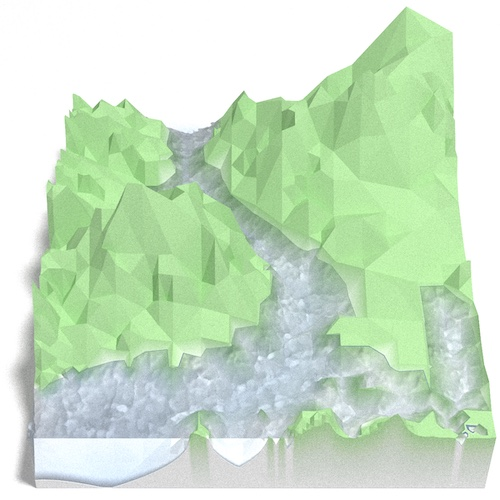
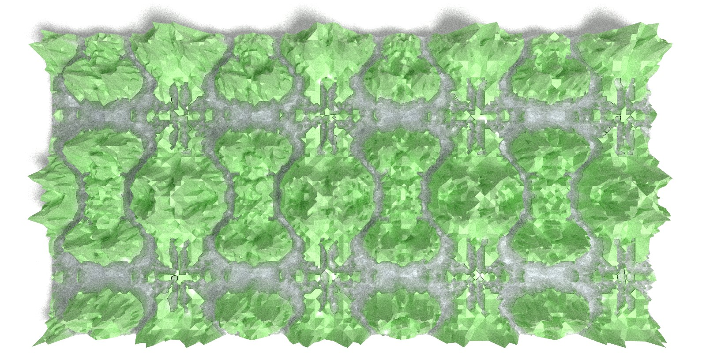
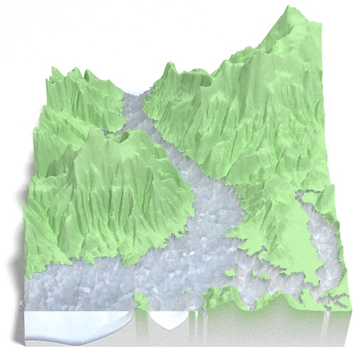

```{r echo=FALSE, child='../../../static/chunks/init.Rmd'}
```
```{r echo=FALSE}
suppressMessages(library(ggplot2))
thm.blnk <- list(
  theme(
    axis.text.x=element_blank(), axis.text.y=element_blank(),
    axis.ticks.x=element_blank(), axis.ticks.y=element_blank(),
    panel.grid=element_blank()
  ),
  ylab(NULL),
  xlab(NULL)
)
```

_Last year's [RTINI Part I][1] post introduces the RTIN mesh approximation
algorithm.  In this post we vectorize the algorithm so that it may be efficient
in R._

# Vectorize The Absolute $#!+ Out Of This



I wish I could tell you that I carefully figured out all the intricacies of the
RTIN algorithm before I set off on my initial vectorization attempt, that I
didn't waste hours going cross-eyed at triangles poorly drawn on scraps of
paper, and that I didn't produce algorithms which closer inspection showed to be
[laughably incorrect][10].  Instead I'll have to be content with telling you
that I did get this to work eventually.

It turns out that that truly understanding an algorithm you're trying to
re-implement is fairly important.  Who woulda thunk?

# Some Triangles Are More Equal Than Others

The root cause of my early failures at re-implementing [&commat;mourner's
`martini`][6] is that there are more different types of triangles than is
obvious at first glance.  They are all isoceles right angled
triangles, but there are eight possible orientations **and** each
orientation is only valid at specific locations in the mesh.

The orientations can be split into two groups of four, with the groups
alternating between approximation levels.  Here we show the orientations for the
2nd and 3rd most granular levels of a 9 x 9 grid[^nine-nine].  The triangles are
colored by orientation.  Because we're very imaginative we'll call the group
diagonal hypotenuses "Diagonal", and the one with vertical/horizontal ones
"Axis":<span id='sqr-vs-dia'></span>

```{r echo=FALSE}
source('../../../static/script/_lib/plot.R')
source('../../../static/script/_lib/rayrender.R')  # for next_file
source('../../../static/script/mesh-viz/viz-lib.R')
source('../../../static/script/mesh-viz/rtin-vec.R')
source('../../../static/script/mesh-viz/rtin-vec2.R')
source('../../../static/script/mesh-viz/extract-vec.R')
  # source('static/script/_lib/plot.R')
  # source('static/script/_lib/rayrender.R')  # for next_file
  # source('static/script/mesh-viz/viz-lib.R')
  # source('static/script/mesh-viz/rtin-vec.R')
  # source('static/script/mesh-viz/rtin-vec2.R')
  # source('static/script/mesh-viz/extract-vec.R')
  # source('static/script/mesh-viz/viz-lib.R')
  # source('static/script/mesh-viz/rtin-vec.R')
err <- matrix(0, 9, 9)
 # note diamond/square is backwards here from what we use in viz-lib
tri.di <- extract_mesh2(err, 1, 4)
tri.sq <- extract_mesh2(err, 1, 3)
tris <- tris_to_df(list(tri.sq, tri.di), err)
tris[['type']] <- factor(
  c(
    rep('Diagonal', length(unlist(tri.sq))),
    rep('Axis', length(unlist(tri.di)))
  ),
  levels=c('Diagonal', 'Axis')
)
points <- tris_to_df(seq_along(err), err)
p <- ggplot(tris) +
  geom_polygon(aes(x=x, y=y, group=id, fill=I(color))) +
  geom_point(data=points, aes(x=x, y=y), size=.5, shape=3, color='white') +
  facet_wrap(~type) +
  coord_fixed() +
  thm.blnk
pdim <- gtable_dim(ggplotGrob(p))
old.opt <- knitr::opts_chunk$get(c('fig.width', 'fig.height'))
do.call(knitr::opts_chunk$set, list(fig.width=pdim[1], fig.height=pdim[2]))
```
```{r square-vs-diamond, echo=FALSE}
p
do.call(knitr::opts_chunk$set, old.opt)
```

The "Axis" triangulation, the one with vertical and horizontal hypotenuses, has
just one tiling pattern.  A particular triangle "shape" (a specific color in the
plot above) must always be arranged in the same way relative to the other shapes
that share the vertex opposite their hypotenuses.  Any other arrangement would
prevent us from fully tiling the grid without breaking up triangles.

On the other hand the "Diagonal" triangulation, has multiple possible tilings:

```{r fig.width=9, echo=FALSE}
  # should have used the offsets for this, but we hadn't written that yet.
raw1 <- c(03,19,01, 03,19,21, 03,23,21, 03,23,05)
raw2 <- raw1 + rep(c(2,-2), each=length(raw1)/2)
rawc1 <- rep(raw1, 2) + rep(0:1 * 4, each=length(raw1))
rawc2 <- rep(raw2, 2) + rep(0:1 * 4, each=length(raw2))
rawc3 <- rep(raw1[1:6], 4) + rep(0:3 * 2, each=6)
f1 <- c(rawc1, rawc2 + 18, rawc1 + 36, rawc2 + 54)
f2 <- rep(rawc1, 4) + rep(0:3 * 18, each=length(rawc1))
f3 <- rep(rawc3, 4) + rep(0:3 * 18, each=length(rawc3))
tris.f1 <- tris_to_df(f1, err)
nms <- sprintf( "Faux Diagonal %d", 1:3)
tris.f1[['type']] <- nms[1]
tris.f2 <- tris_to_df(f2, err)
tris.f2[['type']] <- nms[2]
tris.f3 <- tris_to_df(f3, err)
tris.f3[['type']] <- nms[3]
tris.f <- rbind(subset(tris, type=='Diagonal'), tris.f1, tris.f2, tris.f3)
tris.f[['type']] <- factor(tris.f[['type']], levels=unique(tris.f[['type']]))

p <- ggplot(tris.f) +
  geom_polygon(aes(x=x, y=y, group=id, fill=I(color))) +
  geom_point(data=points, aes(x=x, y=y), size=.5, shape=3, color='white') +
  facet_wrap(~type, nrow=1) +
  coord_fixed() +
  thm.blnk
pdim <- gtable_dim(ggplotGrob(p))
old.opt <- knitr::opts_chunk$get(c('fig.width', 'fig.height'))
do.call(knitr::opts_chunk$set, list(fig.width=pdim[1], fig.height=pdim[2]))
```
<div class=bgw-wide-window>
```{r fake-squares, echo=FALSE}
p
```
</div>

We show just three alternate tilings, although there are `$2^{16}$`.  All of
them perfectly cover the grid with equal sized triangles.  "Faux Diagonal 1" is
even a pretty convincing replica.  Unfortunately only one of them fits exactly
into the next level of coarseness, "Axis" [shown previously](#sqr-vs-dia),
seen here in a green outline:

<div class=bgw-wide-window>
```{r fake-diamonds-outline, echo=FALSE}
bad.1 <- ids_to_df(c(11,13,15,17) + rep(0:3 * 18, each=4), err)
bad.2 <- ids_to_df(c(11,13,15,17) + rep(c(0, 36), each=4), err)
bad.3 <- ids_to_df(c(11,15,31,35) + rep(c(0, 36), each=4), err)
bad.1[['type']] <- factor(nms[1], levels=levels(tris.f[['type']]))
bad.2[['type']] <- factor(nms[2], levels=levels(tris.f[['type']]))
bad.3[['type']] <- factor(nms[3], levels=levels(tris.f[['type']]))

p + geom_polygon(
  data=subset(tris, type=='Axis', -type),
  aes(x, y, group=id), fill=NA, color='green'
) + geom_point(
  data=rbind(bad.1, bad.2, bad.3), aes(x, y),
  fill='blue', color='grey20', shape=21, size=2
)
do.call(knitr::opts_chunk$set, old.opt)
```
</div>

It is only with "Diagonal" that every edge of the parent approximation level
completely overlaps with edges of the child.  Every other arrangement has at
least one parent edge crossing a hypotenuse of a child triangle.  These
crossings are what the blue circles highlight.  Ironically, the best looking
fake is the worst offender.

Herein lies the beauty of [&commat;mourner's][6] implementation; by deriving
child triangles from splitting the parent ones, we guarantee that the child
triangles will conform to the parents.  As I learned painfully no such
guarantees apply when we compute the coordinates directly.

There are many ways to solve this vectorization problem, but the simplest I
could come up with was to treat it as a tiling task.  The idea is to define the
smallest tessellating patterns that extend to the correct layout.  These
patterns can then be repeated as needed in internally vectorized
manner[^int-vec].  This is what they look like for our 9 x 9 example:

```{r echo=FALSE}
tris2 <- transform(
  tris,
  alpha=ave(
    seq_along(id), factor(id), FUN=function(i) all(x[i] <= .5 & y[i] <= .5)
  )
)
p <- ggplot(tris2) +
  geom_polygon(
    aes(x=x, y=y, group=id, fill=I(color), alpha=alpha)
  ) +
  geom_point(data=points, aes(x=x, y=y), size=.5, shape=3, color='white') +
  facet_wrap(~type) +
  scale_alpha_continuous(guide=FALSE, range=c(0.2,1)) +
  coord_fixed() +
  thm.blnk
pdim <- gtable_dim(ggplotGrob(p))
old.opt <- knitr::opts_chunk$get(c('fig.width', 'fig.height'))
do.call(knitr::opts_chunk$set, list(fig.width=pdim[1], fig.height=pdim[2]))
```
```{r square-vs-diamond-tile, echo=FALSE}
p
do.call(knitr::opts_chunk$set, old.opt)
```

<style>
/* urgh another inline style.. */
span.pill           {border-radius:    3px; padding: 1px;}
span.lavender       {background-color: #8da0cb;}
span.orange         {background-color: #fc8d62;}
span.hollow-green   {background-color: #eee; color: #66c2a5;}
</style>

Unfortunately this is insufficient.  We must also for each triangle hypotenuse
midpoint track their children so that we may [carry over][2] their
errors.  One nice benefit of the tessellating pattern is that if we define the
parent-child relationship for the simple tile, we can copy that relationship
along with the rest of the tile.  In fact, we don't actually care about the
triangles.  What we actually want are the hypotenuses (black lines), their
<span class='pill lavender'>midpoints</span>, <span
class='pill hollow-green'>endpoints</span>, and the corresponding <span
class='pill orange'>child hypotenuse midpoints</span>.  The parent/child
relation is shown with the arrows:

```{r echo=FALSE}
p.dg <- ids_to_df(c(offset.dg[,1,] * 9 + offset.dg[,2,] + 1), matrix(0,9,9))
p.ax <- ids_to_df(c(offset.ax[,1,] * 9 + offset.ax[,2,] + 1), matrix(0,9,9))
p.dg[['type']] <- factor('Diagonal', levels=c('Diagonal', 'Axis'))
p.dg[['ptype']] <- 'child'
p.dg[8:12, 'ptype'] <- 'mid'
p.dg[1:8, 'ptype'] <- 'ends'
p.ax[['type']] <- factor('Axis', levels=c('Diagonal', 'Axis'))
p.ax[['ptype']] <- 'child'
p.ax[9:12, 'ptype'] <- 'mid'
p.ax[1:8, 'ptype'] <- 'ends'
p.all <- rbind(p.dg, p.ax)
p.all[['grp']] <- (seq_len(nrow(p.all)) - 1L) %% 4L

to_arrows <- function(grp) {
  ends <- grp[1,,drop=FALSE]
  ends.b <- grp[2,,drop=FALSE]
  mid <- grp[3L,,drop=FALSE]

  child <- grp[-3L,]
  child[['xend']] <- mid[, 'x']
  child[['yend']] <- mid[, 'y']
  x.diff <- child[['xend']] - child[['x']]
  y.diff <- child[['yend']] - child[['y']]
  off.c <- 5
  child[['xend']] <- child[['xend']] - x.diff / off.c
  child[['x']] <- child[['x']] + x.diff / off.c
  child[['yend']] <- child[['yend']] - y.diff / off.c
  child[['y']] <- child[['y']] + y.diff / off.c

  x.diff <- ends.b[['x']] - ends[['x']]
  y.diff <- ends.b[['y']] - ends[['y']]
  off.e <- 30
  ends[['xend']] <- ends.b[['x']] - x.diff / off.e
  ends[['x']] <- ends[['x']] + x.diff / off.e
  ends[['yend']] <- ends.b[['y']] - y.diff / off.e
  ends[['y']] <- ends[['y']] + y.diff / off.e
  rbind(ends, child)
}
p.arr <-
  do.call(rbind, lapply(split(p.all, p.all[c('type', 'grp')]), to_arrows))

p2 <- ggplot(tris2) +
  geom_polygon(aes(x=x, y=y, group=id, fill=I(color)), alpha=.2) +
  geom_point(data=points, aes(x=x, y=y), size=.5, shape=3, color='white') +
  geom_segment(
    data=subset(p.arr, ptype=='child'),
    arrow=arrow(length=unit(.05, 'inches'), type='closed', angle=25),
    aes(x, y, xend=xend, yend=yend),
    color='grey50'
  ) +
  geom_segment(
    data=subset(p.arr, ptype=='ends'),
    aes(x, y, xend=xend, yend=yend)
  ) +
  geom_point(
    data=subset(p.all, ptype=='mid'),
    aes(x, y, colour=I('#8da0cb')),
    size=3
  ) +
  geom_point(
    data=subset(p.all, ptype=='ends'),
    aes(x, y, colour=I('#66c2a5'), fill='grey90'),
    shape=21, size=2
  ) +
  geom_point(
    data=subset(p.all, ptype=='child'),
    aes(x, y, colour=I('#fc8d62'))
  ) +
  facet_wrap(~type) +
  coord_fixed() +
  thm.blnk

pdim <- gtable_dim(ggplotGrob(p2))
old.opt <- knitr::opts_chunk$get(c('fig.width', 'fig.height'))
do.call(knitr::opts_chunk$set, list(fig.width=pdim[1], fig.height=pdim[2]))
```
<div id='sq-vs-diam'>
```{r square-vs-diamond-points, echo=FALSE}
p2
do.call(knitr::opts_chunk$set, old.opt)
```
</div>

Recall: we are trying to compute the error in approximating the hypotenuse <span
class='pill lavender'>midpoints</span> as the mean of the <span
class='pill hollow-green'>endpoints</span>, while carrying over error of the <span class='pill orange'>child midpoint</span> approximations.
Notice how the <span class='pill lavender'>midpoints</span>
of the "Diagonal" layer become the <span class='pill orange'>child midpoints</span> in the "Axis" layer.

> See [RTINI Part I][1] for additional details on the algorithm.

# Now Just Tile the Rest of the $#!+ing Map

Great, we have a concept for how we might parallelize the computation of
critical coordinates, but how exactly do we do this in an efficiently vectorized
manner?  There are likely many ways, but what we'll do is use "linearized"
indices into the matrix.  These indices treat the matrix as if it were a vector.
The first step is to generate the template tile, which we will do with
`init_offsets`, presented here in simplified form[^simplified-offsets]:

```{r eval=FALSE}
init_offsets <- function(i, j, n, layers) {
  o <- if(j == 'axis') offset.ax else offset.dg    # raw coords
  o <- o * 2^(i - 1)                               # scale
  array(o[,1,] + o[,2,] * (n + 1) + 1, dim(o)[-2]) # x/y -> id
}
```

`offset.ax` and `offset.dg` are arrays that contain manually computed x/y
coordinates for each of the points in the template tile.  `init_offsets` scales
those to the appropriate size for the layer and collapses them to "linearized"
coordinates[^linearized]<span id=linearized></span>.  Here is the "Diagonals"
map with the grid points labeled with their "linearized" coordinates and the key
points of the template tile in the same colors as [previously](#sq-vs-diam):

```{r echo=FALSE}
n <- 8
o.d <- init_offsets(i=1, j='diag', n=n, layers=log2(8))
o.a <- init_offsets(i=2, j='axis', n=n, layers=log2(8))

lin.to.xy <- expand.grid(x=0:n, y=0:n)
lin.to.xy <- transform(lin.to.xy, i=(x + 1) + y * (n + 1))
lin.to.xy.all <- rbind(
  transform(lin.to.xy, type='Axis', important=i %in% o.a),
  transform(lin.to.xy, type='Diagonal', important=i %in% o.d)
)
lin.to.xy.all <- transform(
  lin.to.xy.all, color=ifelse(important, 'grey10', 'grey50'),
  type=factor(type, levels=c('Diagonal', 'Axis')),
  size=ifelse(important, 3, 2)
)

p2a <- ggplot(subset(tris2, type == 'Diagonal')) +
  geom_polygon(aes(x=x, y=y, group=id, fill=I(color)), alpha=.2) +
  geom_point(
    data=points,
    aes(x=x, y=y), size=1, shape=3, color='white') +
  geom_point(
    data=subset(p.all, ptype=='mid' & type == 'Diagonal'),
    aes(x, y, colour=I('#8da0cb')),
    size=6
  ) +
  geom_point(
    data=subset(p.all, ptype=='ends' & type == 'Diagonal'),
    aes(x, y, colour=I('#66c2a5'), fill='grey90'),
    shape=21, size=4
  ) +
  geom_point(
    data=subset(p.all, ptype=='child' & type == 'Diagonal'),
    aes(x, y, colour=I('#fc8d62')), size=4
  ) +
  geom_text(
    data=subset(lin.to.xy.all, type == 'Diagonal'),
    aes(x=y/n, y=x/n, label=i, color=I(color), size=I(size))
  ) +
  facet_wrap(~type) +
  # coord_fixed(xlim=c(0, .5), y=c(0, .5)) +
  # coord_fixed() +
  thm.blnk
pdim <- gtable_dim(ggplotGrob(p2a))
old.opt <- knitr::opts_chunk$get(c('fig.width', 'fig.height'))
do.call(knitr::opts_chunk$set, list(fig.width=pdim[1], fig.height=pdim[2]))
```
```{r square-vs-diamond-points-2, echo=FALSE}
p2a
do.call(knitr::opts_chunk$set, old.opt)
```

`init_offsets` produces the coordinates for the template tile:

<!-- really shouldn't be doing these inline styles... -->
<style>
span.bgw-hmid   { padding: .1em 0; background-color: #8da0cb;}
span.bgw-hend   { padding: .1em 0; color: #66c2a5;}
span.bgw-hchild { padding: .1em 0; background-color: #fc8d62;}
</style>

```{r eval=FALSE}
n <- nrow(map)
init_offsets(i=1, j='diag', n=(n - 1), layers=log2(n - 1))
```
<pre><code>     [,1] [,2] [,3] [,4] [,5] [,6] [,7]
[1,] <span class='bgw-hend'>   1   21 </span><span class='bgw-hmid'>  11 </span><span class='bgw-hchild'> 20   10    2   12 </span>
[2,] <span class='bgw-hend'>   5   21 </span><span class='bgw-hmid'>  13 </span><span class='bgw-hchild'> 22   14   12    4 </span>
[3,] <span class='bgw-hend'>  21   37 </span><span class='bgw-hmid'>  29 </span><span class='bgw-hchild'> 38   30   28   20 </span>
[4,] <span class='bgw-hend'>  21   41 </span><span class='bgw-hmid'>  31 </span><span class='bgw-hchild'> 40   30   22   32 </span>
</code></pre>
<!--
```{r eval=FALSE}
init_offsets(i=2, j='axis', n=8, layers=log2(8))
```
<pre><code>     [,1] [,2] [,3] [,4] [,5] [,6] [,7]
[1,] <span class='bgw-hend'>   1    5 </span><span class='bgw-hmid'>   3 </span><span class='bgw-hchild'>  13   11 </span>
[2,] <span class='bgw-hend'>   5   41 </span><span class='bgw-hmid'>  23 </span><span class='bgw-hchild'>  31   13 </span>
[3,] <span class='bgw-hend'>  41   37 </span><span class='bgw-hmid'>  39 </span><span class='bgw-hchild'>  29   31 </span>
[4,] <span class='bgw-hend'>  37    1 </span><span class='bgw-hmid'>  19 </span><span class='bgw-hchild'>  11   29 </span>
</code></pre>
-->

There are repeats as some points are shared across triangles.  For example point
<span class="pill hollow-green">21</span> is a hypotenuse endpoint to all
triangles.  We can't just drop the duplicates as the above structure
tracks the <span class="pill lavender">midpoint</span> by row, and
we need the <span class="pill orange">child midpoints</span> and
<span class="pill hollow-green">endpoints</span> associated with each of them.

We can shift "linearized" coordinates, by simple arithmetic.  For example,
adding one to a coordinate will move it up one row[^shift-with-care].  Adding
`nrow(map)` will shift the coordinates by one column.  So for example:

```{r eval=FALSE}
init_offsets(i=1, j='diag', n=n - 1, layers=log2(8)) + 4 + 4 * n
```

Would shift the template four rows and four columns to produce:

```{r echo=FALSE}
o.d.2 <-
  init_offsets(i=1, j='diag', n=8, layers=log2(8)) + 4 + 4 * 9

lin.to.xy.all <- transform(lin.to.xy, type='Diagonal', important=i %in% o.d.2)
lin.to.xy.all <- transform(
  lin.to.xy.all, color=ifelse(important, 'grey10', 'grey50'),
  type=factor(type, levels=c('Diagonal', 'Axis')),
  size=ifelse(important, 3, 2)
)
off <- .5
p2b <- ggplot(subset(tris2, type == 'Diagonal')) +
  geom_polygon(aes(x=x, y=y, group=id, fill=I(color)), alpha=.2) +
  geom_point(
    data=points,
    aes(x=x, y=y), size=1, shape=3, color='white') +
  geom_point(
    data=subset(p.all, ptype=='mid' & type == 'Diagonal'),
    aes(x + off, y + off, colour=I('#8da0cb')),
    size=6
  ) +
  geom_point(
    data=subset(p.all, ptype=='ends' & type == 'Diagonal'),
    aes(x + off, y + off, colour=I('#66c2a5'), fill='grey90'),
    shape=21, size=4
  ) +
  geom_point(
    data=subset(p.all, ptype=='child' & type == 'Diagonal'),
    aes(x + off, y + off, colour=I('#fc8d62')), size=4
  ) +
  geom_text(
    data=subset(lin.to.xy.all, type == 'Diagonal'),
    aes(x=y/n, y=x/n, label=i, color=I(color), size=I(size))
  ) +
  facet_wrap(~type) +
  # coord_fixed(xlim=c(0, .5), y=c(0, .5)) +
  # coord_fixed() +
  thm.blnk
pdim <- gtable_dim(ggplotGrob(p2a))
old.opt <- knitr::opts_chunk$get(c('fig.width', 'fig.height'))
do.call(knitr::opts_chunk$set, list(fig.width=pdim[1], fig.height=pdim[2]))
```
```{r square-vs-diamond-points-3, echo=FALSE}
p2b
do.call(knitr::opts_chunk$set, old.opt)
```

Tiling is then just a matter of copying and shifting the template tile.

# Action!

Let's look at this in action with the next grid size up for effect.  As we did
in the [prior post](#mesh-anim) we'll track the coordinates in the
left panel side (both "Diagonal" and "Axis", alternating), and the computed mesh
approximation errors in the right hand panel:


<video 
id=mesh-anim-vec style='display: block; margin: 0 auto;' 
controls loop muted
>
<source
static
  src='graphics/out-vec.mp4'
  type="video/mp4"
/>
</video>

For each "layer", we start with a repeatable template sized to the layer.  We
then fill a column with it, then the rest of the surface, and finally we compute
errors.  Here is the same thing as a flipbook with code so we can see how it's
actually done.  Remember that in these flipbooks the state shown is immediately
_after_ the highlighted line is evaluated.  We'll focus on the second set of
layers:

<div id='flipbook-vec' class='bgw-wide-window'></div>

`o`, as shown in the first frame[^first-frame] contains the offsets that
represent the template tile.  These offsets are generated by `init_offsets`,
which we [reviewed earlier](#now-just-tile-the-rest-of-the-ing-map).

Since the tile coordinates are linearized we can shift them by repeating the
template while adding different offsets to each repeat:

```{r eval=FALSE}
seq.r <- (seq_len(tile.n) - 1) * n / tile.n
o <- rep(o, each=tile.n) + seq.r
```

We first repeat the template tile four times (`tile.n`), and then shift them by
`seq.r`:

```{r eval=FALSE}
seq.r
```
```
[1]  0  4  8 12
```

Due to how we repeat `o` each value of `seq.r` will be recycled for every value
of `o`.  The result is to copy the template tile to fill the column.  Similarly
we can fill the rest of the surface by repeating and shifting the column:

```{r eval=FALSE}
o <- rep(o, each=tile.n) + seq.r * (n + 1)
```

The points are arranged by type in the original offset list so we can easily
subset for a particular type of point from the repeated tile set:

```{r eval=FALSE}
o.m <- o[o.i + 2 * o.len]    # midpoint coordinate
o.b <- o[o.i + o.len]        # 1st hypotenuse endpoint coordinate
o.a <- o[o.i]                # 2nd hypotenuse endpoint coordinate
```

This is how the visualization knows to color the points as the point type is
never explicitly stated in the code.  Additionally, the relative positions of
parents and children are also preserved.

After calculating the errors we must record the maximum of the error and child
errors.  This includes the following seemingly funny business:

```{r eval=FALSE}
err.val <- do.call(pmax, err.vals)
err.ord <- order(err.val)                  # <<< Order
errors[o.m[err.ord]] <- err.val[err.ord]
```

This is necessary because for "Axis" tiling the same midpoints may be updated by
two different tiles as is the case here when we fill a column:

```{r echo=FALSE}
p.ax1 <- transform(p.ax, sgrp=1)
p.ax2 <- rbind(transform(p.ax1, sgrp=2), transform(p.ax1, y=y + .5, sgrp=3))
ax.lvl <- c('Axis Single', 'Axis Column')

p.ax1[['type']] <- factor('Axis Single', levels=ax.lvl)
p.ax2[['type']] <- factor('Axis Column', levels=ax.lvl)

p.all2 <- rbind(p.ax1, p.ax2)
p.all2[['grp']] <- (seq_len(nrow(p.all2)) - 1L) %% 4L

p.arr <- do.call(
  rbind, lapply(split(p.all2, p.all2[c('grp', 'sgrp')]), to_arrows)
)

tris3 <- subset(tris2, type == 'Axis')
tris3[['type']] <- NULL

p2 <- ggplot(tris3) +
  geom_polygon(aes(x=x, y=y, group=id, fill=I(color)), alpha=.2) +
  geom_point(data=points, aes(x=x, y=y), size=.5, shape=3, color='white') +
  geom_point(
    data=data.frame(
      x=.25, y=.5,
      type=factor('Axis Column', levels=ax.lvl)
    ), aes(x=x, y=y),
    color='green', size=10
  ) +
  geom_segment(
    data=subset(p.arr, ptype=='child'),
    arrow=arrow(length=unit(.05, 'inches'), type='closed', angle=25),
    aes(x, y, xend=xend, yend=yend),
    color='grey50'
  ) +
  geom_segment(
    data=subset(p.arr, ptype=='ends'),
    aes(x, y, xend=xend, yend=yend)
  ) +
  geom_point(
    data=subset(p.all2, ptype=='mid'),
    aes(x, y, colour=I('#8da0cb')),
    size=3
  ) +
  geom_point(
    data=subset(p.all2, ptype=='ends'),
    aes(x, y, colour=I('#66c2a5'), fill='grey90'),
    shape=21, size=2
  ) +
  geom_point(
    data=subset(p.all2, ptype=='child'),
    aes(x, y, colour=I('#fc8d62'))
  ) +
  facet_wrap(~type) +
  coord_fixed() +
  thm.blnk

pdim <- gtable_dim(ggplotGrob(p2))
old.opt <- knitr::opts_chunk$get(c('fig.width', 'fig.height'))
do.call(knitr::opts_chunk$set, list(fig.width=pdim[1], fig.height=pdim[2]))
```
```{r tile-overlap, echo=FALSE}
p2
do.call(knitr::opts_chunk$set, old.opt)
```

The midpoint highlighted in green is at the overlap of two tiles, so 
we are carrying over errors from children in different tiles.  If we did not
order `err.val` prior to final insertion into the error matrix we risk a lesser
error from one tile overwriting a larger error from another.  This issue
afflicts all the non-peripheral midpoints in the "Axis" tile
arrangement[^not-diag].

The full code of this implementation is available in the
[appendix](#code-appendix).


# Loopy Vectorization?

Hold on a sec, weren't we going to vectorize the $#!+ out of this?  What about
all those for loops?  They are nested three levels deep!  A veritable viper's
nest of looping control structures.  Did we just turn ourselves around and end
up with more loops than we started with?  Strictly speaking we did, but what
matters is how many R-level calls there are, not how many R-level loops.
Particularly once we start getting to large map sizes, the bulk of the
computations are being done in statically compiled code.

Our vectorized algorithm got through the 17 x 17 map in 240 R-level
steps[^step-count].  The original one requires 40,962 for the same map!  The
vectorized algorithm R-level call count will grow with `$log(n)$` where `n` is
the number of rows/cols in the map.  The original transliteration will grow with
`$n^2 .log(n)$`.  There are a similar number of calculations overall, but as
you can see in the animation the vectorized version "batches" many of them into
single R-level calls to minimize the R interpreter overhead.  So yes, despite
the `for` loops our code is very vectorized, and it shows up in the timings:

```{r vec-timings, echo=FALSE}
library(ggplot2)
library(patchwork)
dat <- data.frame(
  Language=factor(
    c('R', 'R-vec-2', 'R-vec', 'JS', 'C'),
    levels=c('C', 'JS', 'R-vec', 'R-vec-2', 'R')
  ),
  Time=c(2500, 15.11, 49.15,20.78,6.81)
)
p1 <- ggplot(dat) +
  geom_col(aes(Language, Time)) +
  geom_text(aes(Language, Time, label=Time), vjust=-.5) +
  ylab('Milliseconds') +
  ggtitle("Normal Scale")

p2 <- p1 + scale_y_log10() + ggtitle("Log Scale") +
  ylab('Milliseconds (log10)')

(p1 + scale_y_continuous(expand = expansion(mult = c(0.05, .1)))) +
  p2 + plot_layout(guides='collect') +
  plot_annotation(
    title='RTIN Error Computation Benchmarks',
    subtitle='257x257 Grid Size'
  ) & theme(legend.position='bottom')
```

The code as shown ("R-vec") is about twice as slow as JavaScript, but fifty
times faster than the R transliteration of the RTIN algorithm!  With some
additional optimizations [I won't bore you with](#follies-in-optimization)
("R-vec-2") we get to beat out JavaScript.  And something remarkable happens as
we increase grid sizes:

```{r vec-timings-3, echo=FALSE, warning=FALSE}
times <- readRDS('data/bench.RDS')

times2 <- do.call(
    rbind,
    Map(
      cbind,
      lapply(
        times[-length(times)],
        function(x) data.frame(x[c('r', 'js', 'c')])
      ),
      size=(2^(6:12)) + 1
) )
times3 <- do.call(
  cbind,
  list(
    data.frame(values=unlist(times2[1:3])),
    Language=toupper(rep(names(times2)[1:3], each=nrow(times2))),
    ind=rep(times2[[4]], 3)
) )

p1 <- ggplot(
  times3,
  aes(
    x=factor(
      ind, levels=as.character(sort(as.integer(as.character(unique(ind)))))
    ),
    y=values, color=Language
  )
) +
  geom_point(position=position_dodge(width=.6), alpha=.5) +
  ggtitle("Normal Scale") +
  ylab('Seconds') +
  xlab('Grid Size') +
  scale_color_manual(values=c('#66c2a5','#fc8d62','#8da0cb')) +
  NULL

p2 <- ggplot(
  times3,
  aes(
    x=factor(
      ind, levels=as.character(sort(as.integer(as.character(unique(ind)))))
    ),
    y=values, color=Language
  )
) +
  geom_point(position=position_dodge(width=.6), alpha=.5) +
  scale_y_log10() +
  ggtitle("Log Scale") +
  ylab('Seconds (log10)') +
  xlab('Grid Size') +
  scale_color_manual(values=c('#66c2a5','#fc8d62','#8da0cb')) +
  NULL

p1 + p2 + plot_layout(guides='collect') +
  plot_annotation(title='RTIN Error Computation Benchmarks vs. Grid Size') &
  theme(legend.position='bottom')
```

The optimized R implementation ("R-vec-2" from the previous chart) beats both
the C and JS implementations by a factor of 2-3x.  At the lower sizes the
overhead of the R calls holds us back, but as the overall computations increase
by `$N^2$`, the number of R calls only increase by `$log(N)$`.  As the `$N^2$`
term grows the vectorized algorithm benefits from requiring fewer steps to
compute the midpoints.

It is also remarkable that JS does as well as C, perhaps with some
more timing volatility due to the overhead of invoking [`V8`][12] via R
and possibly JIT compilation[^js-notes].

Before we move on, a quick recap of some vectorization concepts we applied here:

1. Identify repeating / parallelizable patterns.
2. Structure the data so that the repeating patterns can be processed by
   internally vectorized[^int-vec] functions.
3. Allow R-level loops so long as the number of their iterations is small
   relative to those carried out in internally vectorized code.

To achieve 2. we resorted to carefully structured seed data, and repeated it
either explicitly or implicitly with vector recycling.  We did this both for the
actual data, as well as for the indices we used to subset the data for use in
the vectorized operations.

# Too Square

One advantage of directly computing the hypotenuse midpoint coordinates is that
we are not limited to `$(2^k + 1)$` square elevation maps.  With a little extra
work we can make the vectorized R implementation support any rectangular map
with an odd number of points in both width and height.  The ["R-vec-2"
implementation][11] does exactly that.  This allows us to render the 550 x 505
River Derwent DEM by dropping just one row:

<!--
This horror show is so that we can force a fixed sizes for the video display
window as in auto-play mode it appears to cause the whole page to shift
seemingly at random and having a fixed height with proper aspect ratio seems to
work

Padding top trick from: https://css-tricks.com/aspect-ratio-boxes/
-->
<div class=bgw-wide-window>
<div style='width: 800px; max-width: 100%; margin: 0 auto;'>
<div style='
  width: 800px; max-width: 100%;
  overflow: hidden; padding-top: 100%; position: relative;
'>
<video
  id=derwent-vid
  style='
    display: block; margin: 0 auto;
    width: 800px; max-width: 100%;
    position: absolute; top: 0; right: 0;
  '
  alt='3D rendering of the Derwent with some sea level rise and varying levels
  of mesh approximation'
  loop autoplay muted
  onclick='this.setAttribute("controls", "");'
>
<source
static
  src='graphics/derwent-spin.mp4'
  type="video/mp4"
/>
</video>
</div>
</div>
</div>


The closest dimensions available to the original algorithm are 257 x 257 or 513
x 513, so this is a pretty good feature.  A
[limitation](#grid-flexibility-limitations) is that the full range of
approximation is only available for the `$2^k + 1$` grids the original
algorithm supports, but there are many useful cases where this doesn't matter.
The best example is stitching together `$2^k + 1$` tiles into a larger map that
does not conform to `$2^k +1$`.  The most approximate view will be to resolve
each tile to two triangles, but there should be no need to go more approximate
than that.  In exchange you get a larger map with more flexible dimensions that
has no inconsistencies at the boundaries, such as this one:

<div class='bgw-wide-window'>
<figure>

<figcaption>River Derwent DEM, 2049 x 1025, Low Poly Count, Kaleidoscope
Style.</figcaption>
</figure>
</div>

# Limits of Vectorization

So far we have completely avoided discussion of the second part of the RTIN
algorithm: extraction of approximate meshes subject to an error tolerance.  Here
an [R implementation][13] does worse, but still impressively if we consider that
the JavaScript version is JIT compiled into machine code:

```{r vec-limits, echo=FALSE}
err.time <- readRDS('data/bench-poly.RDS')
poly.time <- readRDS('data/bench-poly-2.RDS')
title <- theme(title=element_text(size=9))
coord <- coord_cartesian(ylim=c(0, .6))
p1 <- ggplot(poly.time) +
  geom_point(aes(x=polys, y=time, color=Language), alpha=.5) +
  ggtitle('Mesh Extraction') + coord + title +
  scale_color_manual(values=c(JS='#fc8d62',R='#8da0cb')) +
  xlab("Polygons (MM)") + ylab("Seconds")
p2 <- ggplot(err.time) +
  geom_point(aes(x=Grid, y=time, color=Language), alpha=.5) +
  ggtitle('Error Calc') +
  ylab(FALSE) + coord + title +
  scale_color_manual(values=c(JS='#fc8d62',R='#8da0cb')) +
  theme(
    axis.title.y=element_blank(), axis.text.y=element_blank(),
    axis.ticks.y=element_blank()
  )
p1 + p2 + plot_layout(guides='collect') +
  plot_annotation(title='RTIN Mesh Extraction vs. Poly Count') &
  theme(legend.position='bottom') &
  plot_layout(widths=c(3,1))
```

On the 1025 x 1025 grid we tested JS is about as much faster at extracting the
meshes (left) as R is at computing the errors (right).  How much this matters is
a function of how many polygons you extract.  The full mesh contains about 2MM
polygons, but it looks good with few as ~200K polygons:

```{=html}
<div class=bgw-wide-window>
<span class=bgw-img-wrap-frame><figure><figcaption
>~4K Polygons</figcaption></figure><figure><figcaption
>~225K Polygons</figcaption></figure><figure><figcaption
>~1,100K Polygons</figcaption></figure></span></div>
```

These are all the River Derwent DEM repeated kaleidoscope style to fill 1025 x
1025 maps.

R is able to beat out JavaScript and even C in the error computation because the
RTIN algorithm is quite "inefficient"[^inefficient].  Watch it [in action][14]
again and notice how many steps it takes to compute the location of the first
point to compute the error at on a 5 x 5 grid.  Compare to how many steps we
need with the [vectorized algorithm](#mesh-anim-vec) to compute every error on a
much larger grid, _including_ child error carry over.  I would expect that if we
implemented the R version of the algorithm in JavaScript the latter would be
faster, assuming the JIT compilation can be as effective as it is with the RTIN
algorithm.

Even when algorithms can be fully internally vectorized[^int-vec] R is at a
disadvantage, usually because vectors need to be re-arranged which requires
generating indices and making copies of the vectors.  Notwithstanding, for such
algorithms it is often possible to get close enough to statically compiled
performance that the R implementation is satisfactory.

# Conclusions



Despite R being saddled with interpreter overhead, it is often possible to write
it in such a way that performance is comparable to statically compiled code.
Sometimes it is easy, sometimes it isn't.  Was it worth it in this case?  Well,
I learned a bit from the process so in the end it was worth it to me.  And as a
result of this we now have a [base-R-only mesh reduction algorithm][19] that
works on a much broader set of meshes than the original RTIN.

<!-- this needs to become a shortcode -->
<!-- this is populated by JS in feedback.html partial -->
<p id='feedback-cont'></p>

# Appendix

## Acknowledgments

The following  are post-specific acknowledgments.  This website owes many
additional thanks to [generous people and organizations][260] that have made it
possible.

* [Vladimir Agafonkin][5] for writing great posts and for introducing me to the
  RTIN algorithm.
* [Tyler Morgan Wall][16] for [`rayrender`][17] with which I made many of the
  illustrations in this post.  Special thanks for the endless stream of new
  features, including bump-mapping for simulating rippling water, preview mode
  to make it easy to set-up scenes, and many more.
* [Michael Sumner][18] for inspiring me to [vectorize the absolute shit out of
  this][7].
* [Thomas Lin Pedersen][300] for [`patchwork`][301] with which I assembled the
  combined plots in this post, and for [`ambient`][302] with which I created the
  water surface maps (based on a [Tyler Morgan Wall gist][210]).
* [Hadley Wickham][202] and the [`ggplot2` authors][203] for `ggplot2` with
  which I made many the plots in this post.
* [Jeroen Ooms][220] for [R interface to `V8`][225] which I used to benchmark
  the JavaScript `martini` implementation.
* Simon Urbanek for the [PNG
  package](https://cran.r-project.org/web/packages/png/index.html) which I used
  while post-processing many of the images in this post.
* The FFmpeg team for [FFmpeg][270] with which I stitched the frames off the
  videos in this post.
* [Oleg Sklyar][123], [Dirk Eddelbuettel][122], [Romain François][121], etal. for
  [`inline`][410] for easy integration of C code into ad-hoc R functions.
* [Cynthia Brewer][390] for color brewer palettes, [one of which][380] I used in
  some plots, and [axismaps][400] for the web tool for picking them.

## Follies in Optimization

If you've read any of my previous blog posts you probably realize by now that I
have a bit of a thing &lt;cough&gt;_unhealthy obsession_&lt;/cough&gt; for
making my R code run fast.  I wouldn't put what's coming next into the
"premature optimization is the root of all evil" category, but rational people
will justifiable question why anyone would spend as much time as I have trying
to make something that doesn't need to be any faster, faster.

A potential improvement over the [initial vectorized implementation](#action) is
to directly compute the midpoint locations.  As we can see here they are
arranged in patterns that we should be able to compute without having to resort
to tiling:

```{r echo=FALSE}
axis <- c(3, 7, 19, 23, 27, 39, 43, 55, 59, 63, 75, 79)
diag <- c(11, 13, 15, 17) + rep(0:3, each=4) * 2 * 9

p.ax3 <- transform(ids_to_df(axis, err), type='Axis', pcolor='#8da0cb')
p.dg3 <- transform(ids_to_df(diag, err), type='Diagonal', pcolor='#8da0cb')

p.all <- rbind(p.ax3, p.dg3)

p2 <- ggplot(tris2) +
  geom_polygon(aes(x=x, y=y, group=id, fill=I(color)), alpha=.2) +
  geom_point(data=points, aes(x=x, y=y), size=.5, shape=3, color='white') +
  geom_point(data=p.all, aes(x, y), colour='#8da0cb', size=3) +
  facet_wrap(~type) +
  coord_fixed() +
  thm.blnk

pdim <- gtable_dim(ggplotGrob(p2))
old.opt <- knitr::opts_chunk$get(c('fig.width', 'fig.height'))
do.call(knitr::opts_chunk$set, list(fig.width=pdim[1], fig.height=pdim[2]))
```
```{r midpoints-2, echo=FALSE}
p2
do.call(knitr::opts_chunk$set, old.opt)
```

<!--
Show the midpoints in a 9x9 grid, side by side for each type of point.
-->

For each layer all the children will be at fixed offsets from the midpoints.
The hypotenuses orientations vary within a layer, so we can't use fixed offsets
for them.  However, if we split the midpoints into two groups (A and B below) we
can use fixed offsets within each group.  For "Diagonal" the groups are
bottom-left to top-right (A) and top-left to bottom-right (B), and for "Axis"
vertical (A) and horizontal (B):

```{r echo=FALSE}
p.ax3.a <- cbind(subset(p.ax3, (x * 4) %% 2 == 0), subtype='A')
p.ax3.b <- cbind(subset(p.ax3, (x * 4) %% 2 != 0), subtype='B')

sw.x <- with(p.dg3, ((x * 8 - 1) / 2) %% 2 > 0)
sw.y <- with(p.dg3, ((y * 8 - 1) / 2) %% 2 > 0)
p.dg3.a <- cbind(subset(p.dg3, !xor(sw.x, sw.y)), subtype='A')
p.dg3.b <- cbind(subset(p.dg3, xor(sw.x, sw.y)), subtype='B')

s <- 1/8

dat <- rbind(
  transform(p.ax3.a, ptype='mid'),
  transform(p.ax3.a, y=y+.25, ptype='end'),
  transform(p.ax3.a, y=y-.25, ptype='end'),
  transform(p.ax3.a, x=x+s, y=y+s, ptype='child'),
  transform(p.ax3.a, x=x+s, y=y-s, ptype='child'),
  transform(p.ax3.a, x=x-s, y=y-s, ptype='child'),
  transform(p.ax3.a, x=x-s, y=y+s, ptype='child'),

  transform(p.ax3.b, ptype='mid'),
  transform(p.ax3.b, x=x+.25, ptype='end'),
  transform(p.ax3.b, x=x-.25, ptype='end'),
  transform(p.ax3.b, x=x+s, y=y+s, ptype='child'),
  transform(p.ax3.b, x=x+s, y=y-s, ptype='child'),
  transform(p.ax3.b, x=x-s, y=y-s, ptype='child'),
  transform(p.ax3.b, x=x-s, y=y+s, ptype='child'),

  transform(p.dg3.a, ptype='mid'),
  transform(p.dg3.a, x=x+s, y=y+s, ptype='end'),
  transform(p.dg3.a, x=x-s, y=y-s, ptype='end'),
  transform(p.dg3.a, x=x+s, ptype='child'),
  transform(p.dg3.a, y=y-s, ptype='child'),
  transform(p.dg3.a, x=x-s, ptype='child'),
  transform(p.dg3.a, y=y+s, ptype='child'),

  transform(p.dg3.b, ptype='mid'),
  transform(p.dg3.b, x=x+s, y=y-s, ptype='end'),
  transform(p.dg3.b, x=x-s, y=y+s, ptype='end'),
  transform(p.dg3.b, x=x+s, ptype='child'),
  transform(p.dg3.b, y=y-s, ptype='child'),
  transform(p.dg3.b, x=x-s, ptype='child'),
  transform(p.dg3.b, y=y+s, ptype='child')
)
dat$pcolor <- as.character(dat$pcolor)
dat[dat$ptype == 'child', 'pcolor'] <- '#fc8d62'
dat[dat$ptype == 'end', 'pcolor'] <- '#66c2a5'
dat <- transform(dat, pfill=pcolor, stringsAsFactors=FALSE)
dat[dat$ptype == 'end', 'pfill'] <- 'grey90'
dat[with(dat, x < 0 | x > 1 | y < 0 | y > 1), 'pfill'] <- 'grey90'
psizes <- c(mid=3, child=2, mid=2)
dat$psize <- psizes[dat$ptype]
dat$id <- c(
  rep(c(1:6, rep(1:6, 2), rep(1:6, 4)), 2),
  rep(c(1:8, rep(1:8, 2), rep(1:8, 4)), 2)
)
dat.arrow <- do.call(
  rbind,
  lapply(
    with(dat, split(dat, list(id, type, subtype))),
    function(x) {
      if(nrow(x)) {
        mid <- x[1,c('x', 'y')]
        cbind(
          x[-(1:3), c('x', 'y', 'type', 'subtype', 'id')],
          setNames(mid, c('xend', 'yend'))
        )
      }
} ) )
dat.hyp <- do.call(
  rbind,
  lapply(
    with(dat, split(dat, list(id, type, subtype))),
    function(x) {
      if(nrow(x)) {
        mid <- x[1,c('x', 'y')]
        cbind(
          x[2:3, c('x', 'y', 'type', 'subtype')],
          setNames(mid, c('xend', 'yend'))
        )
      }
} ) )
dat.arrow <-
  transform(dat.arrow, diag=ifelse(xend - x & yend - y, sqrt(2), 1))
arrow.mult <- log2(nrow(err) - 1) * 13
dat.arrow <- transform(
  dat.arrow,
  xend=xend - sign(xend - x) * 1 / (arrow.mult * diag),
  yend=yend - sign(yend - y) * 1 / (arrow.mult * diag)
)
dat.arrow[['pltype']] <- with(dat.arrow,
  ifelse(x < 0 | y < 0 | x > 1 | y > 1, 3, 1))

p2 <- ggplot(tris2, aes(x, y)) +
  geom_polygon(aes(group=id, fill=I(color)), alpha=.2) +
  geom_point(data=points, size=.5, shape=3, color='white') +
  geom_segment(
    data=dat.arrow,
    arrow=arrow(length=unit(.05, 'inches'), type='closed', angle=25),
    aes(xend=xend, yend=yend, linetype=I(pltype)),
    color='grey50'
  ) +
  geom_segment(
    data=dat.hyp, aes(xend=xend, yend=yend)
  ) +
  geom_point(
    data=subset(dat, !is.na(psize)),
    aes(size=I(psize), color=I(pcolor), fill=I(pfill)),
    shape=21
  ) +
  facet_grid(subtype ~ type) +
  coord_fixed() +
  thm.blnk

old.opt <- knitr::opts_chunk$get(c('fig.width', 'fig.height'))
pdim <- gtable_dim(ggplotGrob(p2), din=c(old.opt$fig.width, old.opt$fig.width))
do.call(knitr::opts_chunk$set, list(fig.width=pdim[1], fig.height=pdim[2]))
```
```{r vec2-points-all, echo=FALSE}
p2
do.call(knitr::opts_chunk$set, old.opt)
```

All is not perfect though: "Axis" is again a problem as the peripheral midpoints
end up generating out-of-bounds children, shown as hollow points / dashed arrows
above.  I won't get into the details, but handling the out-of-bounds children
requires separate treatment for the left/top/right/bottom periphery as well as
the inner midpoints.  We need to handle far more corner cases than with the
template approach which makes the code much [uglier][11].

## Grid Flexibility Limitations

The vectorized RTIN algorithm will work on any rectangular height map with an
odd number of rows and columns, but it will work better with some than others.
For example it works with `volcano`, but the maximum approximation level is not
even throughout the surface:

```{r echo=FALSE}
old.opt <- knitr::opts_chunk$get(c('fig.width', 'fig.height'))
do.call(
  knitr::opts_chunk$set,
  list(fig.height=old.opt[['fig.width']] * ncol(volcano)/nrow(volcano))
)
```
```{r volcano-max, echo=FALSE}
library(rtini)
err <- rtini_error(volcano)
mesh <- rtini_extract(err, tol=1e3)

## Convert linearized indices to x/y in [0,1]
tris <- rbind(do.call(cbind, mesh), NA)
dat <- list(
  y=((tris - 1) %/% nrow(err)) / (nrow(err) - 1),
  x=((tris - 1) %% nrow(err)) / (nrow(err) - 1)
)
par(mai=numeric(4))
plot.new()
plot.window(asp=1, xlim=c(0,1), ylim=range(dat[['y']], na.rm=TRUE))
polygon(dat, col='grey90')
points(
  (expand.grid(seq_len(nrow(err)), seq_len(ncol(err))) - 1) /
  (nrow(err) - 1),
  pch=3, col='white', cex=.3
)
do.call(knitr::opts_chunk$set, old.opt)
```

As we get closer to the top and right edges the largest triangle size we can use
and still conform with the rest of the mesh becomes smaller and smaller.  If
instead of 87 x 61 volcano was 97 x 65 then we would get a much better
most-approximated mesh:

```{r echo=FALSE}
volc2 <- matrix(0, 97, 65)
volc2[seq_len(nrow(volcano)), seq_len(ncol(volcano))] <- volcano
old.opt <- knitr::opts_chunk$get(c('fig.width', 'fig.height'))
do.call(
  knitr::opts_chunk$set,
  list(fig.height=old.opt[['fig.width']] * ncol(volc2)/nrow(volc2))
)
```
```{r volcano-max-2, echo=FALSE}
library(rtini)
err <- rtini_error(volc2)
mesh <- rtini_extract(err, tol=1e3)

## Convert linearized indices to x/y in [0,1]
tris <- rbind(do.call(cbind, mesh), NA)
dat <- list(
  y=((tris - 1) %/% nrow(err)) / (nrow(err) - 1),
  x=((tris - 1) %% nrow(err)) / (nrow(err) - 1)
)
par(mai=numeric(4))
plot.new()
plot.window(asp=1, xlim=c(0,1), ylim=range(dat[['y']], na.rm=TRUE))
polygon(dat, col='grey90')
points(
  (expand.grid(seq_len(nrow(err)), seq_len(ncol(err))) - 1) /
  (nrow(err) - 1),
  pch=3, col='white', cex=.3
)
do.call(knitr::opts_chunk$set, old.opt)
```

The best grids for the R implementation will be `$2^k + 1,  2^kn + 1$`, and
those that are `$2^km + 1, 2^kn + 1$` will be pretty good too.  So long as
we are satisfied with maximum approximation to be `$2^k + 1$`, we can assemble
any tiling of tiles that size into rectangles and we'll be assured to have self
consistent extracted meshes.

## Code Appendix

This is the implementation shown in the [flipbook](#flipbook-vec).  We recommend
you the optimized version from the [RTINI package][19] if you are intending on
using it.

```{r}
 # Offsets are: parenta, parentb, h midpoint, children with variable number of
 # children supported

offset.dg <- aperm(
  array(
    c(
      0L,0L, 2L,2L, 1L,1L, 1L,2L, 0L,1L, 1L,0L, 2L,1L,
      4L,0L, 2L,2L, 3L,1L, 3L,2L, 4L,1L, 2L,1L, 3L,0L,
      2L,2L, 0L,4L, 1L,3L, 1L,4L, 2L,3L, 0L,3L, 1L,2L,
      2L,2L, 4L,4L, 3L,3L, 3L,4L, 2L,3L, 3L,2L, 4L,3L
    ),
    dim=c(2L, 7L, 4L)
  ),
  c(3L, 1L, 2L)
)
 # Smallest size that allows us to define the children with integer
 # values.
offset.ax <- aperm(
  array(
    c(
      0L,0L, 4L,0L, 2L,0L, 3L,1L, 1L,1L,
      4L,0L, 4L,4L, 4L,2L, 3L,3L, 3L,1L,
      4L,4L, 0L,4L, 2L,4L, 1L,3L, 3L,3L,
      0L,4L, 0L,0L, 0L,2L, 1L,1L, 1L,3L
    ),
    dim=c(2L, 5L, 4L)
  ),
  c(3L, 1L, 2L)
)

init_offsets <- function(i, j, n, layers) {
  axis <- j == 'axis'
  o.raw <- if(axis) offset.ax else offset.dg
  if(!axis && i == layers)
    o.raw <- o.raw[1L,,,drop=F]
  if(axis && i == 1L)
    o.raw <- o.raw[,,1:3,drop=F]

  o.raw <- (o.raw * 2^i) %/% (if(axis) 4L else 2L)
  array(o.raw[,1L,] + o.raw[,2L,] * (n + 1L) + 1L, dim(o.raw)[-2L])
}

compute_error3b <- function(map) {
  n <- nrow(map) - 1
  layers <- log2(n)
  errors <- array(NA_real_, dim=dim(map))

  for(i in seq_len(layers)) {
    for(j in c('axis', 'diag')) {
      ## Initialize template tile
      large.tile <- j == 'diag' && i < layers
      tile.n <- n / 2^(i + large.tile)
      o <- init_offsets(i, j, n, layers)
      o.dim <- dim(o)

      ## Tile rest of surface using template
      seq.r <- (seq_len(tile.n) - 1) * n / tile.n
      o <- rep(o, each=tile.n) + seq.r
      o <- rep(o, each=tile.n) + seq.r * (n + 1)

      ## Identify hypotenuse and its midpoint
      o.i <- seq_len(o.dim[1] * tile.n^2)
      o.len <- length(o.i)
      o.m <- o[o.i + 2 * o.len]
      o.b <- o[o.i + o.len]
      o.a <- o[o.i]

      ## Compute estimate and error at midpoint
      m.est <- (map[o.a] + map[o.b]) / 2
      errors[o.m] <- abs(map[o.m] - m.est)

      ## Retrieve child errors
      err.n <- o.dim[2] - 2
      err.i <- err.vals <- vector('list', err.n)
      for(k in seq_len(err.n)) {
        err.i[[k]] <- o[o.i + o.len * (k + 1)]
        err.vals[[k]] <- errors[err.i[[k]]]
      }
      ## Carry over child errors
      err.val <- do.call(pmax, err.vals)
      err.ord <- order(err.val)
      errors[o.m[err.ord]] <- err.val[err.ord]

      err.i <- NULL
      o <- o.m <- o.a <- o.b <- err.val <- NA
  } }
  errors
}
```

## Session Info

```
R version 4.0.3 (2020-10-10)
Platform: x86_64-apple-darwin17.0 (64-bit)
Running under: macOS Catalina 10.15.7

Matrix products: default
BLAS:   /Library/Frameworks/R.framework/Versions/4.0/Resources/lib/libRblas.dylib
LAPACK: /Library/Frameworks/R.framework/Versions/4.0/Resources/lib/libRlapack.dylib

locale:
[1] en_US.UTF-8/en_US.UTF-8/en_US.UTF-8/C/en_US.UTF-8/en_US.UTF-8

attached base packages:
[1] stats     graphics  grDevices utils     datasets  methods   base

other attached packages:
[1] inline_0.3.17    patchwork_1.1.0  ambient_1.0.0    rayrender_0.19.0
[5] vetr_0.2.12

loaded via a namespace (and not attached):
 [1] Rcpp_1.0.5       compiler_4.0.3   pillar_1.4.7     later_1.1.0.1
 [5] tools_4.0.3      jsonlite_1.7.1   lifecycle_0.2.0  tibble_3.0.4
 [9] gtable_0.3.0     pkgconfig_2.0.3  rlang_0.4.9      rstudioapi_0.13
[13] yaml_2.2.1       blogdown_0.21    xfun_0.19        dplyr_1.0.2
[17] stringr_1.4.0    roxygen2_7.1.1   xml2_1.3.2       knitr_1.30
[21] generics_0.1.0   vctrs_0.3.5      tidyselect_1.1.0 grid_4.0.3
[25] glue_1.4.2       R6_2.5.0         processx_3.4.5   bookdown_0.21
[29] ggplot2_3.3.2    purrr_0.3.4      magrittr_2.0.1   servr_0.20
[33] scales_1.1.1     ps_1.4.0         promises_1.1.1   ellipsis_0.3.1
[37] colorspace_2.0-0 httpuv_1.5.4     stringi_1.5.3    munsell_0.5.0
[41] crayon_1.3.4
```

```{r child='../../../static/script/_lib/zoom-img/zoom-img.Rmd', results='asis', cache=FALSE}
```
```{r child='../../../static/script/_lib/flipbook/flipbook.Rmd', results='asis'}
```
<script type='text/javascript'>
const imgDir = 'graphics/flipbook-vec/';
const fps = 4;
new BgFlipBook({
  targetId: 'flipbook-vec', imgDir: imgDir,
  imgStart: 65, imgEnd: 0119,
  imgPad: "0000", fps: fps, loop: false
})
</script>

[1]: /2020/01/27/mesh-reduction-1/
[2]: /2020/01/27/mesh-reduction-1/#carry-over-viz
[3]: /2020/01/27/mesh-reduction-1/#mesh-anim
[5]: https://twitter.com/mourner
[6]: https://observablehq.com/@mourner/martin-real-time-rtin-terrain-mesh
[7]: https://twitter.com/mdsumner/status/1161994475184373761?s=20
[8]: https://www.cs.ubc.ca/~will/papers/rtin.pdf
[6]: https://observablehq.com/@mourner/martin-real-time-rtin-terrain-mesh
[10]: https://twitter.com/BrodieGaslam/status/1166885035489804289?s=20
[11]: https://github.com/brodieG/rtini/blob/v0.1.0/R/error.R#L98
[12]: https://cran.r-project.org/package=V8
[13]: https://github.com/brodieG/rtini/blob/v0.1.0/R/extract.R#L51
[14]: 2020/01/27/mesh-reduction-1/#flipbook1
[15]: https://github.com/r-devel/r-svn/blob/b203a1e4a13407c37aa67ecf85f742b76a333bf7/src/main/arithmetic.h#L65
[16]: http://www.rayrender.net/
[17]: https://twitter.com/tylermorganwall
[18]: https://twitter.com/mdsumner
[19]: https://github.com/brodieG/rtini/
[20]: /2020/12/15/mesh-red-vec/script/prototype.js
[21]: /2020/12/15/mesh-red-vec/script/prototype.c
[202]: https://github.com/hadley
[203]: https://cran.r-project.org/web/packages/ggplot2/index.html
[210]: https://gist.github.com/tylermorganwall/7f31a10f22dc5912cc86b8b312f6f335
[220]: https://github.com/jeroen
[225]: https://cran.r-project.org/package=V8
[300]: https://twitter.com/thomasp85
[301]: https://CRAN.R-project.org/package=patchwork
[121]: https://github.com/romainfrancois
[122]: https://github.com/eddelbuettel
[123]: https://github.com/osklyar
[260]: /about/#acknowledgments
[270]: http://ffmpeg.org/about.html
[302]: https://cran.r-project.org/package=ambient
[380]: http://colorbrewer2.org/#type=qualitative&scheme=Set2&n=3
[390]: http://www.personal.psu.edu/cab38/
[400]: https://www.axismaps.com/
[410]: https://github.com/eddelbuettel/inline

[^step-count]: We're under-counting as the calls used in the vectorized version
  tend to be more complex, and we also have `init_offsets` that hides some
  calls.
[^simplified-offsets]: The actual implementation needs to handle
  several special cases, such as the largest size "Diagonal" that only contains
  one hypotenuse instead of the typical four, and the smallest size "Axis" that
  does not have any children.  The unused variable `layers` is used to identify
  the corner cases in the full version.
[^shift-with-care]: But watch out for row shifts that cause column shifts, or
  column shifts that take you out of bounds.
[^not-diag]: In the "Diagonal" tiles the midpoints are on the inside of the tile
  so there is no overlap issue.
[^nine-nine]: Some tiling issues become apparent at this size that are less
  obvious at smaller sizes.
[^linearized]: [&commat;mourner's][6] implementation used this approach, and
  since it saves space and may be faster computationally I adopted it.  To
  preserve my sanity I transpose the coordinates in the actual implementation so
  that the matrix representation aligns with the plotted one (i.e. x corresponds
  to columns, y to rows, albeit with y values in the wrong direction).  In other
  words, `x <- (id - 1) %/% nrow(map)`, and `y <- (id - 1) %% nrow(map)`
[^int-vec]: Internally vectorized operations loop through elements of a vector
  with statically compiled code instead of explicit R loops such as `for`,
  `lapply`.
[^first-frame]: First frame in the flipbook, but step 65 in the overall
  animation.
[^inefficient]: I use quotes here because the inefficiency isn't necessarily
  bad.  The RTIN algorithm handles many corner cases gracefully by virtue of how
  it computes the triangle hypotenuse midpoints, and it is efficient enough to
  be useful.
[^js-notes]: I made some small changes to the JavaScript implementation for ease
  if interchange with R via the V8 package.  Most significant is that we no
  longer use 32 bit floats.  JavaScript is actually a little faster than C when
  using 32 bit floats, which makes sense since the [C implementation][21] is
  using doubles.  Additionally, for mesh extraction we pre-allocate a vector of
  maximal possible size rather than using a Geometry object as I did not want to
  have to chase down what that was and how to use it.  You can inspect the [JS
  versions of the code][20] used in this post yourself if you're curious.
