<STYLE type='text/css' scoped>
PRE.fansi SPAN {padding-top: .25em; padding-bottom: .25em};
</STYLE>


# Vectorize The Absolute $#!+ Out Of This


I wish I could tell you that I carefully figured out all the intricacies of the
algorithm before I set off on my initial vectorization attempt, that I didn't
waste hours going cross-eyed at triangles poorly drawn on scraps of paper, and
that I didn't produce algorithms which closer inspection showed to be [laughably
incorrect][10].  Instead I'll have to be content with telling you that I did get
this to work eventually.  A victory that had it wasted lives like it wasted my
time would supplant those of Pyrrhus in the history books[^grandiloquence].

> Last year's [Part I][1] of this series introduces the RTIN mesh approximation
> algorithm.  This post assumes familiarity with the prior post.

While I was generally aware that there is more to the problem than generating
equal sized triangles, I underestimated the degrees of freedom available and
wasted quite a bit of time going in circles as a result.  There are eight
different triangle orientations, split into two groups of four.  The groups
alternate between approximation levels.  Here we show the orientations for the
2nd and 3rd most granular levels of a 9 x 9 grid[^nine-nine].  The triangles
are colored by orientation.  For reasons that will become clearer later we call
the group with diagonal hypotenuses "Diagonal", and the one with
vertical/horizontal ones "Axis":<span id='sqr-vs-dia'></span>


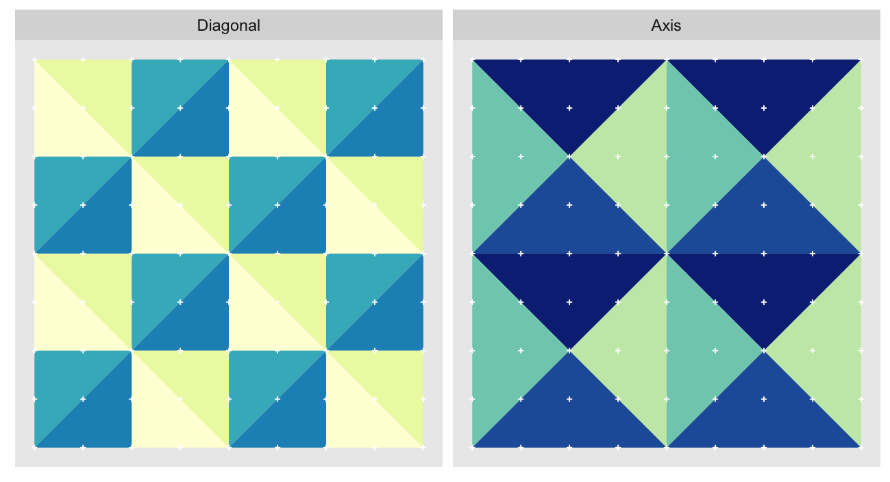

The "Diagonal" triangulation, the one with vertical and horizontal hypotenuses,
has just one tiling pattern.  A particular triangle "shape" (a specific color in
the plot above) must always be arranged in the same way relative to the other
shapes that share the vertex opposite their hypotenuses.  Any other arrangement
would prevent us from fully tiling the grid without breaking up triangles.

On the other hand the "Axis" triangulation, the one with the diagonal
hypotenuses, has multiple possible tilings:


<div class=bgw-wide-window>
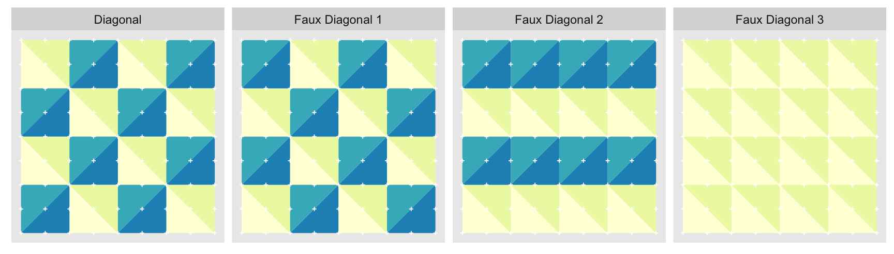
</div>

We show just three alternate tilings, although there are `$2^{16}$`.  All of
them perfectly cover the grid with equal sized triangles.  "Faux Diagonal 1" is
even a pretty convincing replica.  Unfortunately only one of them fits exactly
into the next level of coarseness, "Axis" [shown previously](#sqr-vs-dia),
seen here in a green outline:

<div class=bgw-wide-window>
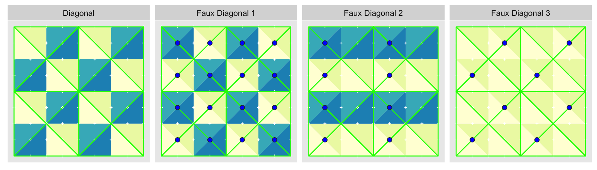
</div>

It is only with "Diagonal" that every edge of the parent approximation level
completely overlaps with edges of the child.  Every other arrangement has at
least one parent edge crossing a hypotenuse of a child triangle.  These
crossings are what the blue circles highlight.  Ironically, the best looking
fake is the worst offender.

Herein lies the beauty of [&commat;mourner's][6] implementation; by deriving
child triangles from splitting the parent ones, we guarantee that the child
triangles will conform to the parents.  As I learned painfully no such
guarantees apply when we compute the coordinates directly.

There are many ways to solve this vectorization problem, but the simplest I
could come up with was to treat it as a tiling task.  The idea is to define the
smallest tessellating patterns that extend to the correct layout.  These
patterns can then be repeated as needed in internally vectorized
manner[^int-vec].  This is what they look like for our 9 x 9 example:


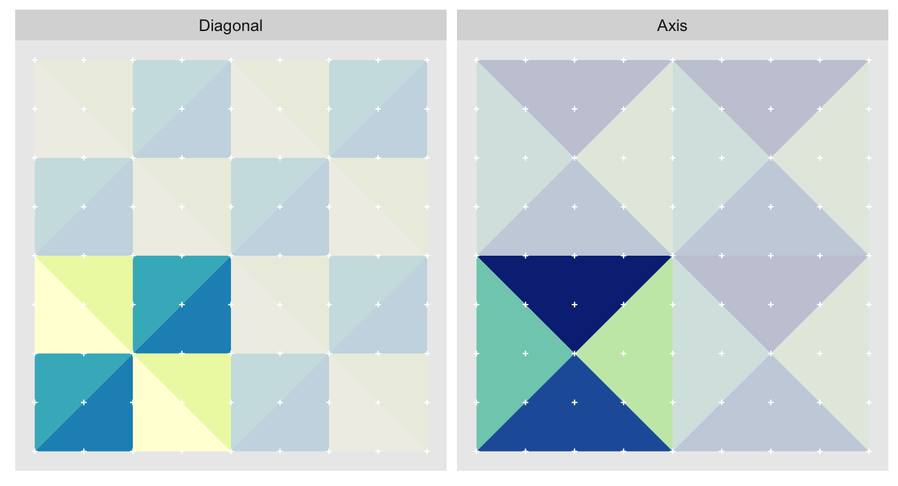

Unfortunately this is insufficient.  We must also for each triangle hypotenuse
midpoint track their children so that we may [carry over](#carry-over-viz) their
errors.  One nice benefit of the tessellating pattern is that if we define the
parent-child relationship for the simple tile, we can copy that relationship
along with the rest of the tile.  In fact, we don't actually care about the
triangles.  What we actually want are the hypotenuses (black), their midpoints
(<span style='background-color: #8da0cb'>lavender</span>) and endpoints(hollow <span
style='color: #66c2a5'>green</span> ), and the corresponding child
hypotenuse midpoints (<span style='background-color: #fc8d62'>orange</span>).
The parent/child relation is shown with the arrows:


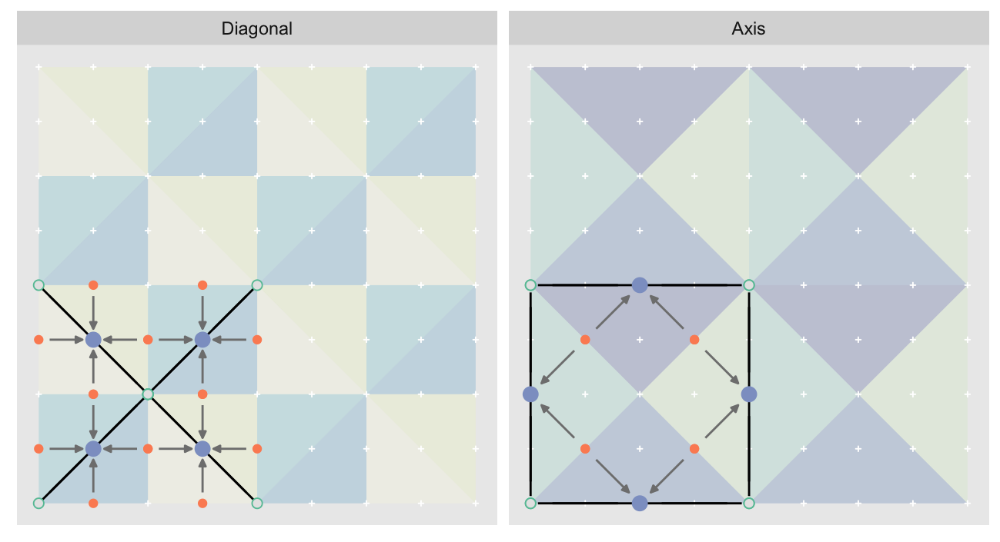

# Action!

Let's look at this in action with the next grid size up for effect.  As we did
in our [earlier visualization](#mesh-anim) we'll track the coordinates in the
left panel side (both "Diagonal" and "Axis", alternating), and the computed mesh
approximation errors in the right hand panel:

<div style='background-color: red;'>Regen video with seq.r line order change</div>

<video id=mesh-anim-vec style='display: block; margin: 0 auto;' controls loop>
<source
static
  src='graphics/out-vec.mp4'
  type="video/mp4"
/>
</video>

Indeed we can see that for each "layer", we start with a repeatable template
sized to the layer.  We then fill a column with it, then the rest of the
surface, and finally we compute errors.  Here is the same thing as a flipbook
with code so we can see how it's actually done.  Remember that in these
flipbooks the state shown is immediately _after_ the highlighted line is
evaluated.  We'll focus on the second set of layers:

<div id='flipbook-vec' class='bgw-wide-window'></div>

`o`, as shown in the first frame[^first-frame] contains the *o*ffsets that
represent the template tile.  These offsets are generated by `init_offsets`,
which in _simplified_[^simplified-offsets] form is:


```r
init_offsets <- function(i, j, n, layers) {
  o <- if(j == 'axis') offset.ax else offset.dg    # raw coords
  o <- o * 2^(i - 1)                               # scale
  array(o[,1,] + o[,2,] * (n + 1) + 1, dim(o)[-2]) # x/y -> id
}
```

`offset.ax` and `offset.dg` contain x/y coordinates for each of the points in
the template tile.  `init_offsets` scales those to the appropriate size for the
layer and collapses them to "linearized" coordinates<span id=linearized></span>:

<!-- really shouldn't be doing these inline styles... -->
<style>
span.bgw-hmid   { padding: .1em 0; background-color: #8da0cb;}
span.bgw-hend   { padding: .1em 0; color: #66c2a5;}
span.bgw-hchild { padding: .1em 0; background-color: #fc8d62;}
</style>


```r
init_offsets(i=2, j='axis', n=16, layers=log2(16))
```
<pre><code>     [,1] [,2] [,3] [,4] [,5]
[1,]  <span class='bgw-hend'>  1    5 </span><span class='bgw-hmid'>   3 </span><span class='bgw-hchild'>  21   19 </span>
[2,]  <span class='bgw-hend'>  5   73 </span><span class='bgw-hmid'>  39 </span><span class='bgw-hchild'>  55   21 </span>
[3,]  <span class='bgw-hend'> 73   69 </span><span class='bgw-hmid'>  71 </span><span class='bgw-hchild'>  53   55 </span>
[4,]  <span class='bgw-hend'> 69    1 </span><span class='bgw-hmid'>  35 </span><span class='bgw-hchild'>  19   53 </span>
</code></pre>

```r
init_offsets(i=2, j='diag', n=16, layers=log2(16))
```
<pre><code>     [,1] [,2] [,3] [,4] [,5] [,6] [,7]
[1,]  <span class='bgw-hend'>  1   73 </span><span class='bgw-hmid'>  37 </span><span class='bgw-hchild'>  71   35    3   39 </span>
[2,]  <span class='bgw-hend'>  9   73 </span><span class='bgw-hmid'>  41 </span><span class='bgw-hchild'>  75   43   39    7 </span>
[3,]  <span class='bgw-hend'> 73  137 </span><span class='bgw-hmid'> 105 </span><span class='bgw-hchild'> 139  107  103   71 </span>
[4,]  <span class='bgw-hend'> 73  145 </span><span class='bgw-hmid'> 109 </span><span class='bgw-hchild'> 143  107   75  111 </span>
</code></pre>

In "linearized" form for our 17 x 17 example, 1 corresponds to (x,y) coordinate
(1,1), 2 to (1,2),  18 to (2,1), 289 to (17,17), etc.[^linearized].  The colors
match those of the visualization.  We can shift "linearized" coordinates,
by simple arithmetic.  For example, adding one to a coordinate will move it up
one row[^shift-with-care].  Adding `(n + 1)`, where `n <- nrow(map) - 1`, shifts
coordinates by one column.  So in:


```r
seq.r <- (seq_len(tile.n) - 1) * n / tile.n
o <- rep(o, each=tile.n) + seq.r
```

We first repeat the template tile four times, and then shift them by `seq.r`:


```r
seq.r
```
```
[1]  0  4  8 12
```

Due to how we repeat `o` each value of `seq.r` will be recycled for every value
of `o`.  The result is to copy the template tile to fill the column.  Similarly:


```r
o <- rep(o, each=tile.n) + seq.r * (n + 1)
```

Will fill the rest of the surface by repeating and shifting the column.

The points are arranged by type in the original offset list so we can easily
subset for a particular type of point from the repeated tile set.  This is
exactly how the visualization colors the points as the point type is never
explicitly stated in the code.  Additionally, the relative positions of parents
and children are also preserved.

# Loopy Vectorization?

Hold on a sec, weren't we going to vectorize the $#!+ out of this?  What about
all those for loops?  They are nested three levels deep!  A veritable viper's
nest of looping control structures.  Did we just turn ourselves around and end
up with more loops than we started with?  Strictly speaking we did, but what
matters is how many R-level calls there are, not how many R-level loops.
Particularly once we start getting to large map sizes, the bulk of the
computations are being done in statically compiled code.

Our vectorized algorithm got through the 17 x 17 map in 240 R-level
steps[^step-count].  The original one requires 40,962 for the same map!  The
vectorized algorithm R-level call count will grow with `$log{n}$` where `n` is
the number of rows/cols in the map.  The original transliteration will grow with
`$n^2 .log(n)$`.  There are a similar number of calculations overall, but as
you can see in the animation the vectorized version "batches" many of them into
single R-level calls to minimize the R interpreter overhead.  So yes, despite
the `for` loops our code is very vectorized, and it shows up in the timings:

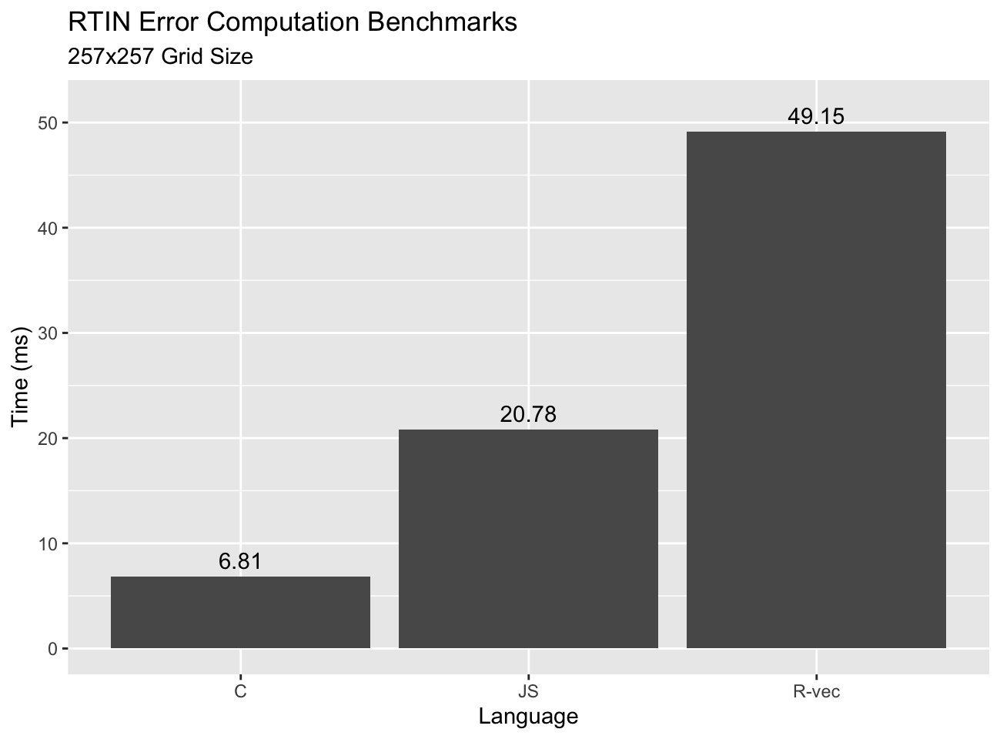

Now we're in business.  We're beating neither C nor JavaScript, but
we're in the same conversation, and there is room to do better.  This
initial vectorized implementation is geared for clarity over speed.  There are
some simple changes that will double the speed[^double-speed], but we have even
grander aspirations.

Before we move on, a quick recap of some vectorization concepts we applied here:

1. Identify repeating / parallelizable patterns.
2. Structure the data in such a way that the repeating patterns can be processed
   by internally vectorized functions.
3. Allow R-level loops so long as the number of their iterations is small
   relative to those carried out in internally vectorized code.

To achieve 2. we resorted to carefully structured seed data, and
repeated it either explicitly or implicitly with vector recycling.  We did this
both for the actual data, as well as for the indices we used to subset the data
for use in the vectorized operations.

# Follies in Optimization

If you've read any of my previous blog posts you probably realize by now that I
have a bit of a thing &lt;cough&gt;_unhealthy obsession_&lt;/cough&gt; for
making my R code run fast.  I wouldn't put what's coming next into the
"premature optimization is the root of all evil" category, but rational people
will justifiable question why anyone would spend as much time as I have trying
to make something that doesn't need to be any faster, faster.

Well, I have an itch I want to scratch and I will go ahead and scratch it,
rationality be damned.

Let's look back at our first vectorized implementation.  In particular at the
child error carry over section at the end:


```r
 # Carry over child errors
err.val <- do.call(pmax, err.vals)
err.ord <- order(err.val)
errors[o.m[err.ord]] <- err.val[err.ord]
```

You'll notice a seemingly odd `order` call.  This is necessary because for the
"Axis" tiles there is overlap between tiles.  Compare our earlier example with a
single tile and then with the tile repeated to fill a column:


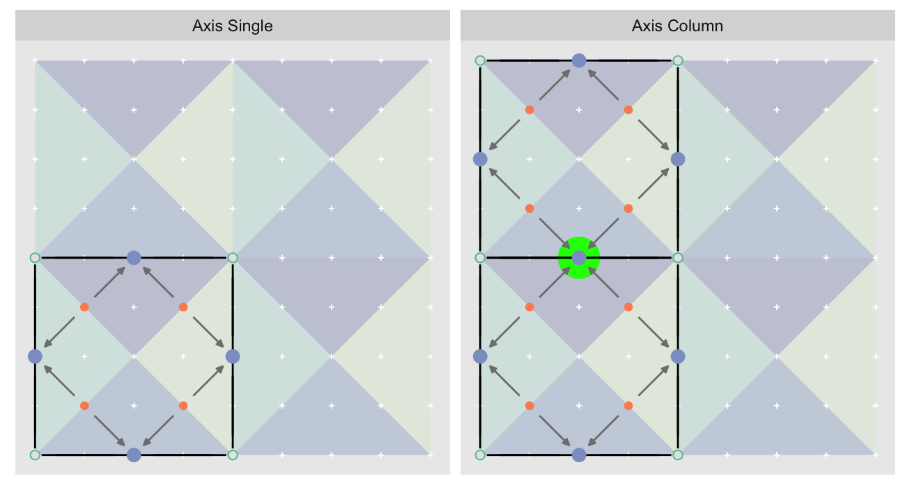

<span id='vec-inefficiency'></span>
The midpoint highlighted in green is at the overlap of two tiles.  There are two
not-so-great things about this.  The first is that the midpoint estimate and
errors get computed twice, once for each tile.  The second is that we are
carrying over errors from children in different tiles, which is what requires us
to order `err.val` prior to final insertion into the error matrix.  If we didn't
we risk a lesser error from one tile overwriting a larger error from another.
This issue afflicts all the non-peripheral midpoints in the "Axis" tile
arrangement[^not-diag].

A potential improvement is to directly compute the midpoint locations.  As we
can see here they are arranged in patterns that we should be able to compute
without having to resort to tiling:


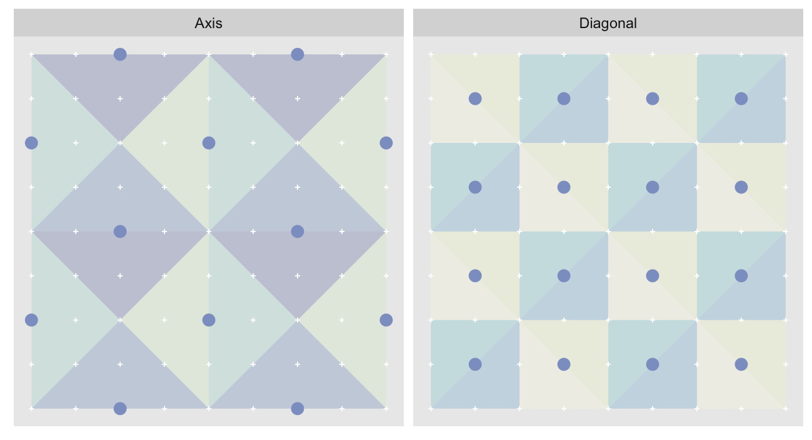

<!--
Show the midpoints in a 9x9 grid, side by side for each type of point.
-->

For each layer all the children will be at fixed offsets from the midpoints.
The hypotenuses orientations vary within a layer, so we can't use fixed offsets
for them.  However, if we split the midpoints into two groups (A and B below) we
can use fixed offsets within each group.  For "Diagonal" the groups are
bottom-left to top-right (A) and top-left to bottom-right (B), and for "Axis"
vertical (A) and horizontal (B):


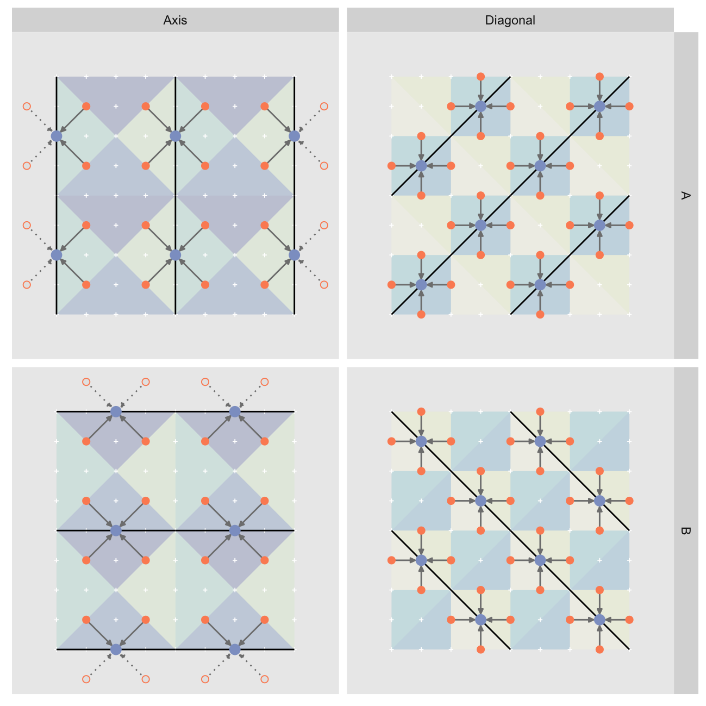

All is not perfect though: "Axis" is again a problem as the peripheral midpoints
end up generating out-of-bounds children, shown as hollow points / dahsed arrows
above.  I won't get into the details, but handling the out-of-bounds children
requires separate treatment for the left/top/right/bottom periphery as well as
the inner midpoints.  We need to handle far more corner cases than with the
template approach which makes the code much [uglier][11].  It is also faster:

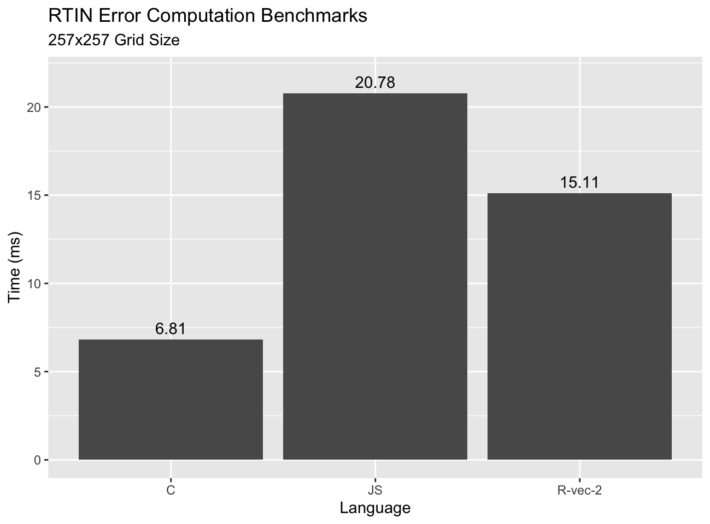

And something remarkable happens as we increase grid sizes:

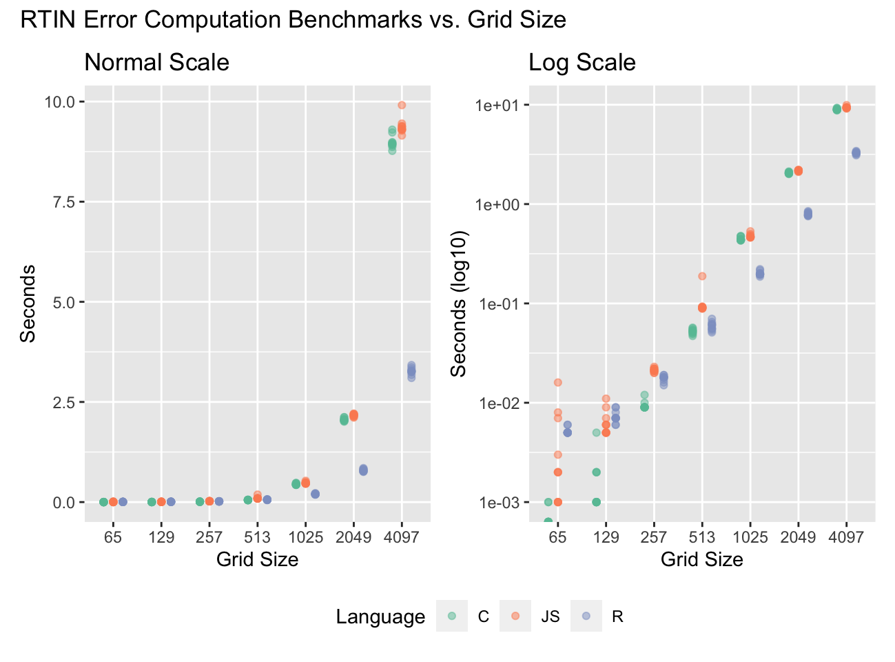

The R implementation beats both the C and JS implementations by a factor of
2-3x.  At the lower sizes the overhead of the R calls holds us back, but as the
overall computations increase by `$N^2$`, the number of R calls only increase by
`$log(N)$`.  As the `$N^2$` term grows the vectorized algorithm
benefits from requiring fewer steps to compute the midpoints, granted
at the cost of implementation complexity.

It is also remarkable that JS does as well as C, perhaps with some
more timing volatility due to the overhead of invoking [`V8`][12] via R
and possibly JIT compilation.

# Limits of Vectorization

So far we have completely avoided discussion of the second part of the RTIN
algorithm: extraction of approximate meshes subject to an error tolerance.  Here
the R implementation does worse, but still impressively if we consider that the
JavaScript version is JIT compiled into machine code:

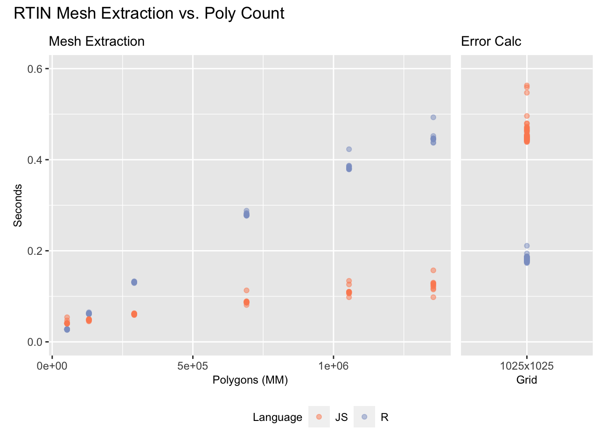

On the 1025 x 1025 grid we tested JS is about as much faster at extracting the
meshes (left) as R is at computing the errors (right).  How much this matters is
a function of how many polygons you extract.  The full mesh as about 2MM
polygons, but it looks good with few as ~150K polygons:

<div style='background-color: red'>Low poly vs high poly<div>

R is able to beat out JavaScript and even C in the error computation because the 
RTIN algorithm is quite "inefficient"[^inefficient].  Watch it [in action][14]
again and notice how many steps it takes to compute the location of the first
point to compute the error at on a 5 x 5 grid.  Compare to how many steps we
need with the [vectorized algorithm](#mesh-anim-vec) to compute every error on a
much larger grid, _including_ child error carry over.  I would expect that if we
implemented the R version of the algorithm in JavaScript the latter would be
faster, assuming the JIT compilation can be as effective as it is with the RTIN
algorithm.

Even when algorithms can be fully internally[^int-vec] vectorized R works
uphill because it is not possible to modify vectors in place.  For example, with
three equal size large vectors `x`, `y`, and `z`, the operation:


```r
x <- x + y + z
```

Leads to the allocation of two new vectors: one for the result of `y + z`, one
for the result of `x + (y + z)` which is then bound to `x`.  If `x` is large
this means quite a bit of memory.  The more operations there are, the more
temporary vectors we need.  In non-vectorized implementations, even those that
don't modify the result in place, the temporary values can be scalars that
perhaps even remain is register values until they are written to the final
result vector.

Thankfully modern super scalar systems are very good at computing serially on
large contiguous blocks of memory, so the penalty from vectorized calculations
due to the temporary vectors is low, and we can approach the performance of
compiled languages for vectorizable algorithms.


# Too Square

One advantage of directly computing the hypotenuse midpoint coordinates is that
we are not limited to `$(2^k + 1)$` square elevation maps.  The vectorized R
implementation supports any rectangular map with an odd number of points in both
width and height.

If you were looking closely at `volcano` in the [previous post][1] you might
have noticed we chopped it off at the knees.  The R implementation can handle
the entire surface:

<div style='background-color: red'>Rayrender of volcano 65x65 vs full volcano at
some specified tolerance</div>

There is a significant limitation though: because the approximations are done
within `$(2^k + 1)$` squares parts of the grid that do not fit nicely inside
larger `$(2^k + 1)$` tiles will remain granular no matter how high we set the
tolerance.  For example, for `volcano` this is the most approximate grid we
could produce:


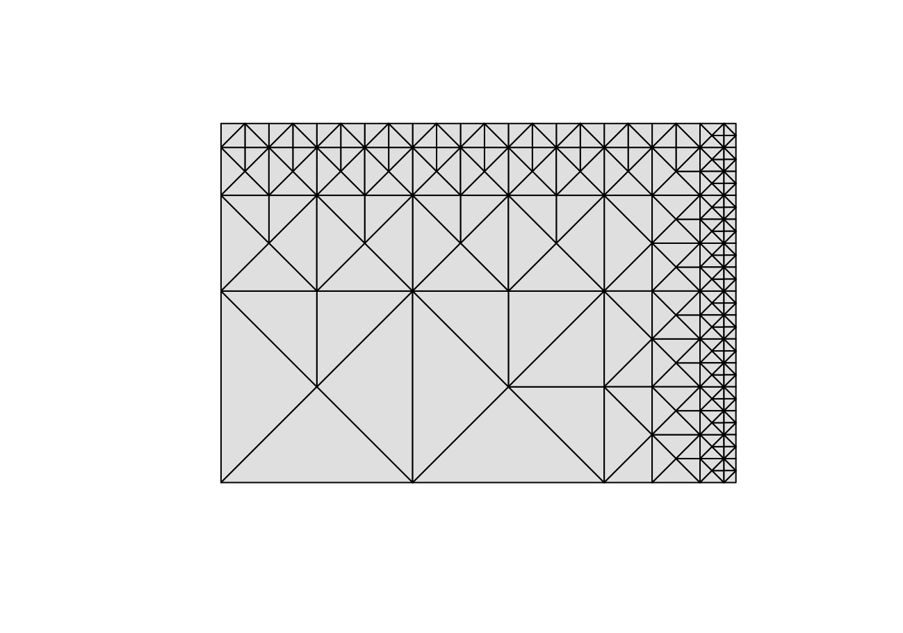

As we get closer to the top and right edges the largest triangle size we can use
and still conform with the rest of the mesh becomes smaller and smaller.  If
instead of 87 x 61 volcano was 97 x 65 then we would get a much better
most-approximated mesh:


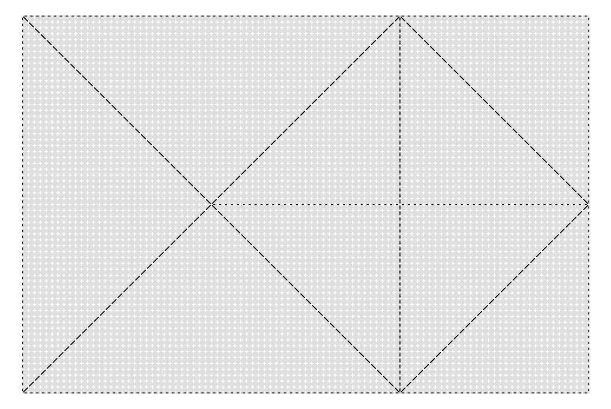

The best grids for the R implementation will be `$2^k + 1, n * 2^k + 1$`, and
those that are `$m * 2^k + 1, n * 2^k + 1$` will be pretty good too.  So long as
we are satisfied with maximum approximation to be `$2^k + 1$`, we can assemble
any tiling of tiles that size into rectangles and we'll be assured to have self
consistent extracted meshes.

Either way, that the algorithm _works_ with a broad set of grid sizes, even with
potentially varying levels of maximum approximation, is useful.  For example, we
can use it on the 550 x 505 River Derwent DEM by just dropping 1 row:

<div style='background-color: red'>video</div>

The uneven approximation along the edges only becomes obvious at extreme
tolerance levels we would be unlikely to use in reality.

# Trade-offs

In exchange for more complex vectorized code, we get faster and more flexible
RTIN error computation.  But the error computation is only half the story.  We
must also extract the mesh for any given tolerance.  Here, it is

# Conclusions

<!-- this needs to become a shortcode -->
<!-- this is populated by JS in feedback.html partial -->
<p id='feedback-cont'></p>

# Appendix

## Acknowledgments

* patchwork
* ambient
* rgl
* rayrender
* Agafonkin
* reshape2
* ggplot2
* ffmpeg
* inline
* Brewer
* dplyr for bind_rows

## Session Info


<!--
  Flipbook HTML template, intended to be copied for use in actual instantiated
  flipbooks

  DO NOT INDENT!! Otherwise pandoc will think it is markdown code.
-->
<div id='bg-flipbook-template' style='display: none;'>
<div id='bg-flipbook-images' style='display: none'></div>
<div
  id='bg-flipbook-container'
  style='margin: auto; display: inline-block; max-width: 98%;'
>
<canvas
  id='bg-flipbook-flipbook'
  style='display: block; max-width: 100%;'
>
This is an HTML Canvas flipbook that displays key frames of an animation in a
more controllable manner than in a video player.  If you are reading this text
your browser does not support HTML Canvas.
</canvas>
<!--
We have to use a P block here as otherwise pandoc adds a P block for the
inline elements
-->
<p style='margin-top: 5px; margin-bottom: 0px; text-align: initial;'>
<input
  id='bg-flipbook-help' type='button' value='?' style='font-size: 18px;'
  title='Display help overlay'
/>
<input
  id='bg-flipbook-play' type='button' value='&#x25b6;' style='font-size: 18px;'
  title='Play/Pause'
/>
<input
  id='bg-flipbook-stop' type='button' value='&#x25a0;' style='font-size: 18px;'
  title='Stop and Reset'
/>
&nbsp;
<input
  id='bg-flipbook-step-b' type='button' value='&#x21E4;' style='font-size: 18px;'
  title='Step Backwards'
/>
<input
  id='bg-flipbook-step-f' type='button' value='&#x21E5;' style='font-size: 18px;'
  title='Step Forwards'
/>
&nbsp;
FPS:
<input
  id='bg-flipbook-fps' type='text'
  style='width: 3ex; font-size: 18px; text-align: right; min-height: 0;
  line-height: 1; padding: 0;'
  title='Set Playback Rate' value=3
/>
<span id=bg-flipbook-frame-span>
&nbsp;
#:
<input
  id='bg-flipbook-frame'
  type='text'
  style='width: 2.5ex; font-size: 18px; text-align: right; min-height: 0;
  line-height: 1; padding: 0;'
  value=1
  title='(Jump to) frame #'
/> / <span id='bg-flipbook-frame-n'></span>
&nbsp;
<label title='Loop-play'>
  <span
    id='bg-flipbook-loop-ind'
    style='font-size: 1.3em; font-weight: bold;'>&#x293E;</span>:
  <input id='bg-flipbook-loop' value=1 type='checkbox' />
</label>
</span>
</p>
</div>
</div>
<script type='text/javascript' src='/script/_lib/flipbook/flipbook.js'></script>
<script type='text/javascript'>
const imgDir = 'graphics/flipbook-vec/';
const fps = 4;
new BgFlipBook({
  targetId: 'flipbook-vec', imgDir: imgDir,
  imgStart: 65, imgEnd: 0119,
  imgPad: "0000", fps: fps, loop: false
})
</script>

[1]: /2020/01/27/mesh-reduction-1/
[5]: https://twitter.com/mourner
[6]: https://observablehq.com/@mourner/martin-real-time-rtin-terrain-mesh
[7]: https://twitter.com/mdsumner/status/1161994475184373761?s=20
[8]: https://www.cs.ubc.ca/~will/papers/rtin.pdf
[6]: https://observablehq.com/@mourner/martin-real-time-rtin-terrain-mesh
[10]: https://twitter.com/BrodieGaslam/status/1166885035489804289?s=20
[11]: https://github.com/brodieG/rtini/blob/v0.1.0/R/error.R#L98
[12]: https://cran.r-project.org/package=V8
[13]: https://github.com/brodieG/rtini/blob/v0.1.0/R/extract.R#L51
[14]: 2020/01/27/mesh-reduction-1/#flipbook1

[^step-count]: We're under-counting as the calls used in the vectorized version
  end to be more complex, and we also have `init_offsets` that hides some calls.
[^simplified-offsets]: The actual implementation needs to handle several special
 cases, such as the largest size "Diagonal" that only contains one hypotenuse
 instead of the typical four, and the smallest size "Axis" that does not have
 any children.  The unused variable `layers` is used to identify the corner
 cases in the full version.
[^shift-with-care]: But watch out for row shifts that cause column shifts, or
  column shifts that take you out of bounds.
[^not-diag]: In the "Diagonal" tiles the midpoints are on the inside of the tile
  so there is no overlap issue.
[^nine-nine]: Some tiling issues become apparent at this size that are less
  obvious at smaller sizes.
[^linearized]: [&commat;mourner's][6] implementation used this approach, and
  since it saves space and may be faster computationally I adopted it.  To
  preserve my sanity I transpose the coordinates in the actual implementation so
  that the matrix representation aligns with the plotted one (i.e. x corresponds
  to columns, y to rows, albeit with y values in the wrong direction).  In other
  words, `x <- (id - 1) %/% nrow(map)`, and `y <- (id - 1) %% nrow(map)`
[^int-vec]: Internally vectorized operations loop through elements of a vector
  with statically compiled code instead of explicit R loops such as `for`,
  `lapply`.
[^grandiloquence]: If nothing else I feel I've earned the right not to be
  embarrassed by misplaced eructations of grandiloquence.
[^first-frame]: First frame in the flipbook, but step 65 in the overall
  animation.
[^double-speed]: As we'll see [later](#vec-inefficiency) the ordering step at
  the end is only required for "Axis" tiles, and can be skipped for the first
  layer altogether as in that layer "Axis" tiles have no children (this is also
  the largest layer so there is a big gain from skipping it).
[^inefficent]: I use quotes here because the inefficiency isn't necessarily
  bad.  The RTIN algorithm handles many corner cases gracefully by virtue of how
  it computes the triangle hypotenuse midpoints, and it is efficient enough to
  be useful.

